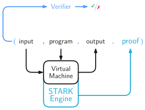

# Triton VM

[](https://opensource.org/licenses/MIT)
[](https://opensource.org/licenses/Apache-2.0)
[](https://crates.io/crates/triton-vm)
[](https://github.com/TritonVM/triton-vm/actions)
[](https://github.com/TritonVM/triton-vm/actions/workflows/link_checker.yml)
[](https://triton-vm.org/spec/)
[](https://coveralls.io/github/TritonVM/triton-vm?branch=master)

Triton is a virtual machine that comes with Algebraic Execution Tables (AET) and Arithmetic
Intermediate Representations (AIR) for use in combination with
a [STARK proof system](https://neptune.cash/learn/stark-anatomy/). It defines a Turing
complete [Instruction Set Architecture](https://triton-vm.org/spec/isa.html), as well as the
corresponding [arithmetization](https://triton-vm.org/spec/arithmetization.html) of the VM. The
really cool thing about Triton VM is its efficient _recursive_ verification of the STARKs produced
when running Triton VM.

## Getting Started

If you want to start writing programs for Triton VM, check out the
[Triton TUI](https://github.com/TritonVM/triton-tui). If you want to run a Triton assembly program,
generate or verify proofs of correct execution, or
[profile the performance](https://github.com/TritonVM/triton-cli#profiling) of either of these,
check out the [Triton CLI](https://github.com/TritonVM/triton-cli). If you want to use Triton VM as
a library, check out the [examples](triton-vm/examples).

## Recursive STARKs of Computational Integrity

Normally, when executing a machine – virtual or not – the flow of information can be regarded as
follows. The tuple of (`input`, `program`) is given to the machine, which takes the `program`,
evaluates it on the `input`, and produces some `output`.


If the – now almost definitely virtual – machine also has an associated STARK engine, one additional
output is a `proof` of computational integrity.


Only if `input`, `program`, and `output` correspond to one another, i.e., if `output` is indeed the
result of evaluating the `program` on the `input` according to the rules defined by the virtual
machine, then producing such a `proof` is easy. Otherwise, producing a `proof` is next to
impossible.

The routine that checks whether a `proof` is, in fact, a valid one, is called the Verifier. It takes
as input a 4-tuple (`input`, `program`, `output`, `proof`) and evaluates to `true` if and only if
that 4-tuple is consistent with the rules of the virtual machine.



Since the Verifier is a program taking some input and producing some output, the original virtual
machine can be used to perform the computation.


The associated STARK engine will then produce a proof of computational integrity of _verifying_ some
other proof of computational integrity – recursion!
Of course, the Verifier can be a subroutine in a larger program.

Triton VM is specifically designed to allow fast recursive verification.

## Project Status

Triton VM is still under construction. We currently don't recommend using it in production.

Please note that the [Instruction Set Architecture](https://triton-vm.org/spec/isa.html) is not to
be considered final. However, we don't currently foresee big changes.

## Specification

The specification can be found [online](https://triton-vm.org/spec/). Alternatively, you can
self-host the [mdBook](https://rust-lang.github.io/mdBook/) by first installing the dependencies,
then serving the mdBook.

```sh
cargo install mdbook
cargo install mdbook-katex
cargo install mdbook-linkcheck

mdbook serve --open
```

Potentially, `~/.cargo/bin` needs to be added to the PATH.

## Running the Code

The Rust implementation of Triton VM resides in [triton-vm](./triton-vm) and can
be [found on crates.io](https://crates.io/crates/triton-vm).

Triton VM depends on the [`twenty-first`](https://crates.io/crates/twenty-first) cryptographic
library.

For trying out the code, [install Rust](https://www.rust-lang.org/tools/install) and run:

```sh
~ $ git clone https://github.com/TritonVM/triton-vm.git
~ $ cd triton-vm
~/triton-vm $ make test
```

For local development of both libraries, it is encouraged to
follow [GitHub's fork & pull workflow][gh-fap] by forking and cloning both, place `twenty-first`
relative to `triton-vm`, and change the dependency to be `path`-local:

[gh-fap]: https://reflectoring.io/github-fork-and-pull/

```sh
~ $ git clone git@github.com:you/triton-vm.git
~ $ git clone git@github.com:you/twenty-first.git
~ $ cd triton-vm
~/triton-vm $ ln -s ../twenty-first/twenty-first twenty-first
~/triton-vm $ sed -i '/^twenty-first =/ s/{.*}/{ path = "..\/twenty-first" }/' triton-vm/Cargo.toml 
```
