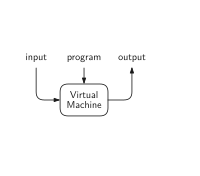
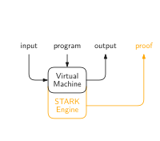
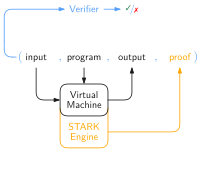
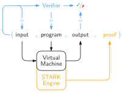

# Triton VM

Triton is a virtual machine that comes with Algebraic Execution Tables (AET) and Arithmetic Intermediate Representations (AIR) for use in combination with a [STARK proof system](https://neptune.cash/learn/stark-anatomy/).
It defines a Turing complete [Instruction Set Architecture](./specification/isa.md), as well as the corresponding [arithmetization](./specification/arithmetization.md) of the VM.
The really cool thing about Triton VM is its efficient _recursive_ verification of the STARKs produced when running Triton VM.

## Recursive STARKs of Computational Integrity

Normally, when executing a machine – virtual or not – the flow of information can be regarded as follows.
The tuple of (`input`, `program`) is given to the machine, which takes the `program`, evaluates it on the `input`, and produces some `output`.



If the – now almost definitely virtual – machine also has an associated STARK engine, one additional output is a `proof` of computational integrity.



Only if `input`, `program`, and `output` correspond to one another, i.e., if `output` is indeed the result of evaluating the `program` on the `input` according to the rules defined by the virtual machine, then producing such a `proof` is easy.
Otherwise, producing a `proof` is next to impossible.

The routine that checks whether or not a `proof` is, in fact, a valid one, is called the Verifier.
It takes as input a 4-tuple (`input`, `program`, `output`, `proof`) and evaluates to `true` if and only if that 4-tuple is consistent with the rules of the virtual machine.



Since the Verifier is a program taking some input and producing some output, the original virtual machine can be used to perform the computation.



The associated STARK engine will then produce a proof of computational integrity of _verifying_ some other proof of computational integrity – recursion!
Of course, the Verifier can be a subroutine in a larger program.

Triton VM is specifically designed to allow fast recursive verification.

## Project Status

Triton VM is still under construction.
We currently don't recommend using it in production.

Please note that the [Instruction Set Architecture](./specification/isa.md) is not to be considered final.
However, we don't currently foresee big changes.

## Running the Code

The Rust implementation of Triton VM resides in [triton-vm](./triton-vm) and can be [found on crates.io](https://crates.io/crates/triton-vm).

Triton VM depends on the [twenty-first](https://crates.io/crates/twenty-first) cryptographic library.

For trying out the code, [install Rust](https://www.rust-lang.org/tools/install) and run:

```
~/Projects $ git clone https://github.com/TritonVM/triton-vm.git
~/Projects $ cd triton-vm/triton-vm
~/Projects/triton-vm/triton-vm $ cargo test
```

For local development, it is encouraged to fork and clone both and place them relative to one another:

```
~/Projects $ git clone git@github.com:you/triton-vm.git
~/Projects $ git clone git@github.com:you/twenty-first.git
~/Projects $ cd triton-vm
~/Projects/triton-vm $ ln -s ../twenty-first/twenty-first twenty-first
```

This makes Cargo prefer the `path = "../twenty-first"` copy of twenty-first over the version on crates.io, as described in [The Cargo Book: Multiple Locations](https://doc.rust-lang.org/cargo/reference/specifying-dependencies.html#multiple-locations)
