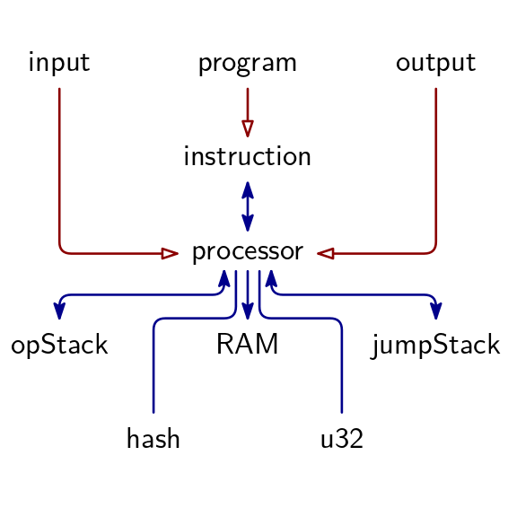

# Triton VM Arithmetization

This document describes the arithmetization of Triton VM, whose instruction set architecture is defined [here](isa.md).
An arithmetization defines two things:
1. algebraic execution tables (AETs), and
1. arithmetic intermediate representation (AIR) constraints.
The nature of Triton VM is that the execution trace is spread out over multiple tables, but linked through permutation and evaluation arguments.

Elsewhere, the acronym AET stands for algebraic execution *trace*.
In the nomenclature of this note, a trace is a special kind of table that tracks the values of a set of registers across time.

The values of all registers, and consequently the elements on the stack, in memory, and so on, are elements of the _B-field_, i.e., $\mathbb{F}_p$ where $p=2^{64}-2^{32}+1$.
All values of columns corresponding to one such register are elements of the B-Field as well.
The entries of a table's columns corresponding to Evaluation or Permutation Arguments are elements from the _X-Field_ $\mathbb{F}_{p^3}$.

For each table, up to three lists containing constraints of different type are given:
1. Consistency Constraints, establishing consistency within any given row,
1. Boundary Constraints, defining values in a table's first row and, in some cases, also the last, and
1. Transition Constraints, establishing the consistency of two consecutive rows in relation to each other.

Together, all these constraints constitute the AIR constraints.

## Algebraic Execution Tables

There are 8 Arithmetic Execution Tables in TritonVM.
Their relation is described by below figure.
A red arrow indicates an Evaluation Argument, a blue line indicates a Permutation Argument.

Public (but not secret!) input and output are given to the Verifier explicitly.
As a consequence, neither the input nor the output symbols are recorded in a table.
Correct use of public input (respectively, output) in the Processor is achieved by an Evaluation Argument.
Given the list of input (or output) symbols, the verifier can compute the Evaluation Argument's terminal explicitly, and consequently compare it to the corresponding terminal in the Processor Table.

Despite the fact that neither public input nor output have a dedicated table, them having Evaluation Arguments with the Processor Table justifies their appearance in below figure.

### Processor Table

The processor consists of all registers defined in the [Instruction Set Architecture](isa.md).
Each register is assigned a column in the processor table.

**Padding**

After the Processor Table is filled in, its length being $l$, the table is padded until a total length of $2^{\lceil\log_2 l\rceil}$ is reached (or 0 if $l=0$).
Each padding row is a direct copy of the Processor Table's last row, with the exception of the cycle count column `clk`.
Column `clk` increases by 1 between any two consecutive rows, even padding rows.

**Consistency Constraints**

1. The composition of instruction buckets `ib0`-`ib5` corresponds the current instruction `ci`.
1. Register `st0` is 0 or `inv` is the inverse of `st0`.
1. Register `inv` is 0 or `inv` is the inverse of `st0`.

**Consistency Constraints as Polynomials**

1. `ci - (2^5·ib5 + 2^4·ib4 + 2^3·ib3 + 2^2·ib2 + 2^1·ib1 + 2^0·ib0)`
1. `st0·(st0·inv - 1)`
1. `inv·(st0·inv - 1)`

**Boundary Constraints**

1. The cycle counter `clk` is 0.
1. The instruction pointer `ip` is 0.
1. The jump address stack pointer `jsp` is 0.
1. The jump address origin `jso` is 0.
1. The jump address destination `jsd` is 0.
1. The operational stack element `st0` is 0.
1. The operational stack element `st1` is 0.
1. The operational stack element `st2` is 0.
1. The operational stack element `st3` is 0.
1. The operational stack element `st4` is 0.
1. The operational stack element `st5` is 0.
1. The operational stack element `st6` is 0.
1. The operational stack element `st7` is 0.
1. The operational stack element `st8` is 0.
1. The operational stack element `st9` is 0.
1. The operational stack element `st10` is 0.
1. The operational stack element `st11` is 0.
1. The operational stack element `st12` is 0.
1. The operational stack element `st13` is 0.
1. The operational stack element `st14` is 0.
1. The operational stack element `st15` is 0.
1. The operational stack pointer `osp` is 16.
1. The operational stack value `osv` is 0.
1. The RAM value `ramv` is 0.
1. In the last row, current instruction register `ci` is 0, corresponding to instruction `halt`.

**Boundary Constraints as Polynomials**

1. `clk`
1. `ip`
1. `jsp`
1. `jso`
1. `jsd`
1. `st0`
1. `st1`
1. `st2`
1. `st3`
1. `st4`
1. `st5`
1. `st6`
1. `st7`
1. `st8`
1. `st9`
1. `st10`
1. `st11`
1. `st12`
1. `st13`
1. `st14`
1. `st15`
1. `osp`
1. `osv`
1. `ramv`
1. `ci`

**Transition Constraints**

Due to their complexity, instruction-specific constraints are defined [in their own section further below](#instruction-specific-transition-constraints).
The following constraint applies to every cycle.

1. The cycle counter `clk` increases by 1.

**Transition Constraints as Polynomials**

1. `clk' - (clk + 1)`

**Relations to Other Tables**

1. A Permutation Argument with the [Instruction Table](#instruction-table).
1. An Evaluation Argument with the input symbols.
1. An Evaluation Argument with the output symbols.
1. A Permutation Argument with the [Jump Stack Table](#jump-stack-table).
1. A Permutation Argument with the [OpStack Table](#operational-stack-table).
1. A Permutation Argument with the [RAM Table](#random-access-memory-table).
1. An Evaluation Argument with the [Hash Table](#hash-coprocessor-table) for copying the input to the hash function from the Processor to the Hash Coprocessor.
1. An Evaluation Argument with the [Hash Table](#hash-coprocessor-table) for copying the hash digest from the Hash Coprocessor to the Processor.
1. A Permutation Argument with the [uint32 Table](#uint32-operations-table) for instruction `lt`.
1. A Permutation Argument with the [uint32 Table](#uint32-operations-table) for instruction `and`.
1. A Permutation Argument with the [uint32 Table](#uint32-operations-table) for instruction `xor`.
1. A Permutation Argument with the [uint32 Table](#uint32-operations-table) for instruction `rev`.
1. A Permutation Argument with the [uint32 Table](#uint32-operations-table) for instruction `div`.

### Program Table

The Virtual Machine's Program Memory is read-only.
The corresponding Program Table consists of two columns, `address` and `instruction`.
The latter variable does not correspond to the processor's state but to the value of the memory at the given location.

| Address | Instruction |
|:--------|:------------|
| -       | -           |

The Program Table is static in the sense that it is fixed before the VM runs.
Moreover, the user can commit to the program by providing the Merkle root of the zipped FRI codeword.
This commitment assumes that the FRI domain is fixed, which implies an upper bound on program size.

**Padding**

After the Program Table is filled in, its length being $l$, the table is padded until a total length of $2^{\lceil\log_2 l\rceil}$ is reached (or 0 if $l=0$).
Each padding row is a direct copy of the Program Table's last row, with the exception of the column `address`.
Column `address` increases by 1 between any two consecutive rows, even padding rows.

**Consistency Constraints**

None.

**Boundary Constraints**

1. The first address is 0.

**Boundary Constraints as Polynomials**

1. `addr`

**Transition Constraints**

1. The address increases by 1.

**Transition Constraints as Polynomials**

1. `addr' - (addr + 1)`

**Relations to other Tables**

1. An Evaluation Argument establishes that the rows of the Program Table match with the unique rows of the [Instruction Table](#instruction-table).

### Instruction Table

The Instruction Table establishes the link between the program and the instructions that are being executed by the processor.
The table consists of three columns:
1. the instruction's `address`,
1. the `current_instruction`, and
1. the `next_instruction_or_arg`.

It contains
- one row for every instruction in the [Program Table](#program-table), i.e., one row for every available instruction, and
- one row for every cycle `clk` in the [Processor Table](#processor-table), i.e., one row for every executed instruction.

The rows are sorted by `address`.

When copying the [Program Table](#program-table) with its two columns into the Instruction Table with its three columns, the value in `next_instruction_or_arg` is the value from the Program Table's _next_ row's `instruction` column (or 0 if no next row exists).
For an example, see below.

Program Table:

| Address | Instruction |
|--------:|:------------|
|       0 | push        |
|       1 | 10          |
|       2 | push        |
|       3 | 5           |
|       4 | add         |
|       … | …           |

Instruction Table:

| `address` | `current_instruction` | `next_instruction_or_arg` | (comment)              |
|----------:|:----------------------|:--------------------------|:-----------------------|
|         0 | push                  | 10                        | (from Program Table)   |
|         0 | push                  | 10                        | (from Processor Table) |
|         1 | 10                    | push                      | (from Program Table)   |
|         2 | push                  | 5                         | (from Program Table)   |
|         2 | push                  | 5                         | (from Processor Table) |
|         3 | 5                     | add                       | (from Program Table)   |
|         4 | add                   | …                         | (from Program Table)   |
|         … | …                     | …                         | …                      |

**Padding**

After the Instruction Table is filled in, its length being $l$, the table is padded until a total length of $2^{\lceil\log_2 l\rceil}$ is reached (or 0 if $l=0$).
Each padding row is a direct copy of the Instruction Table's last row, with the exception of the column `address`.
Column `address` increases by 1 between any two consecutive rows if at least one of the two rows is a padding row.

**Consistency Constraints**

None.

**Boundary Constraints**

None

**Terminal Constraints**

None

**Transition Constraints**

1. The address increases by 1 or `current_instruction` does not change.
1. The address increases by 1 or `next_instruction_or_arg` does not change.

**Transition Constraints as Polynomials**

1. `(address' - address + 1)·(current_instruction' - current_instruction)`
1. `(address' - address + 1)·(next_instruction_or_arg' - next_instruction_or_arg)`

**Relations to Other Tables**

1. An Evaluation Argument establishes that the set of unique rows corresponds to the instructions as given by the [Program Table](#program-table).
1. A Permutation Argument establishes that the rows not included in above Evaluation Argument correspond to the values of the registers (`ip, ci, nia`) of the [Processor Table](#processor-table).

### Jump Stack Table

The Jump Stack Memory contains the underflow from the Jump Stack.
TritonVM defines three registers to deal with the Jump Stack:
1. `jsp`, the jump stack pointer, which points to a location in Jump Stack Memory
1. `jso`, the last jump's origin, which points to a location in Program Memory, and
1. `jsd`, the last jump's destination, which also points to a location in Program Memory.

The Jump Stack Table is a table whose columns are a subset of those of the Processor Table.
The rows are sorted by jump stack pointer (`jsp`), then by cycle counter (`clk`).
The column `jsd` contains the destination of stack-extending jump (`call`) as well as of the no-stack-change jump (`recurse`);
the column `jso` contains the source of the stack-extending jump (`call`) or equivalently the destination of the stack-shrinking jump (`return`).

The AIR for this table guarantees that the return address of a single cell of return address memory can change only if there was a `call` instruction.

An example program, execution trace, and jump stack table are shown below.

Program:

| `address` | `instruction` |
|:----------|:--------------|
| `0x00`    | `foo`         |
| `0x01`    | `bar`         |
| `0x02`    | `call`        |
| `0x03`    | `0xA0`        |
| `0x04`    | `buzz`        |
| `0x05`    | `bar`         |
| `0x06`    | `call`        |
| `0x07`    | `0xB0`        |
| `0x08`    | `foo`         |
| `0x09`    | `bar`         |
| ⋮         | ⋮             |
| `0xA0`    | `buzz`        |
| `0xA1`    | `foo`         |
| `0xA2`    | `bar`         |
| `0xA3`    | `return`      |
| `0xA4`    | `foo`         |
| ⋮         | ⋮             |
| `0xB0`    | `foo`         |
| `0xB1`    | `call`        |
| `0xB2`    | `0xC0`        |
| `0xB3`    | `return`      |
| `0xB4`    | `bazz`        |
| ⋮         | ⋮             |
| `0xC0`    | `buzz`        |
| `0xC1`    | `foo`         |
| `0xC2`    | `bar`         |
| `0xC3`    | `return`      |
| `0xC4`    | `buzz`        |

Execution trace:

| `clk` | `ip`   | `ci`     | `nia`    | `jsp` | `jso`  | `jsd`  | jump stack                           |
|:------|:-------|:---------|:---------|:------|:-------|:-------|:-------------------------------------|
| 0     | `0x00` | `foo`    | `bar`    | 0     | `0x00` | `0x00` | [ ]                                  |
| 1     | `0x01` | `bar`    | `call`   | 0     | `0x00` | `0x00` | [ ]                                  |
| 2     | `0x02` | `call`   | `0xA0`   | 0     | `0x00` | `0x00` | [ ]                                  |
| 3     | `0xA0` | `buzz`   | `foo`    | 1     | `0x04` | `0xA0` | [(`0x04`, `0xA0`)]                   |
| 4     | `0xA1` | `foo`    | `bar`    | 1     | `0x04` | `0xA0` | [(`0x04`, `0xA0`)]                   |
| 5     | `0xA2` | `bar`    | `return` | 1     | `0x04` | `0xA0` | [(`0x04`, `0xA0`)]                   |
| 6     | `0xA3` | `return` | `foo`    | 1     | `0x04` | `0xA0` | [(`0x04`, `0xA0`)]                   |
| 7     | `0x04` | `buzz`   | `bar`    | 0     | `0x00` | `0x00` | [ ]                                  |
| 8     | `0x05` | `bar`    | `call`   | 0     | `0x00` | `0x00` | [ ]                                  |
| 9     | `0x06` | `call`   | `0xB0`   | 0     | `0x00` | `0x00` | [ ]                                  |
| 10    | `0xB0` | `foo`    | `call`   | 1     | `0x08` | `0xB0` | [(`0x08`, `0xB0`)]                   |
| 11    | `0xB1` | `call`   | `0xC0`   | 1     | `0x08` | `0xB0` | [(`0x08`, `0xB0`)]                   |
| 12    | `0xC0` | `buzz`   | `foo`    | 2     | `0xB3` | `0xC0` | [(`0x08`, `0xB0`), (`0xB3`, `0xC0`)] |
| 13    | `0xC1` | `foo`    | `bar`    | 2     | `0xB3` | `0xC0` | [(`0x08`, `0xB0`), (`0xB3`, `0xC0`)] |
| 14    | `0xC2` | `bar`    | `return` | 2     | `0xB3` | `0xC0` | [(`0x08`, `0xB0`), (`0xB3`, `0xC0`)] |
| 15    | `0xC3` | `return` | `buzz`   | 2     | `0xB3` | `0xC0` | [(`0x08`, `0xB0`), (`0xB3`, `0xC0`)] |
| 16    | `0xB3` | `return` | `bazz`   | 1     | `0x08` | `0xB0` | [(`0x08`, `0xB0`)]                   |
| 17    | `0x08` | `foo`    | `bar`    | 0     | `0x00` | `0x00` | [ ]                                  |

Jump Stack Table:

| `clk` | `ci`     | `jsp` | `jso`  | `jsd`  |
|:------|:---------|:------|:-------|:-------|
| 0     | `foo`    | 0     | `0x00` | `0x00` |
| 1     | `bar`    | 0     | `0x00` | `0x00` |
| 2     | `call`   | 0     | `0x00` | `0x00` |
| 7     | `buzz`   | 0     | `0x00` | `0x00` |
| 8     | `bar`    | 0     | `0x00` | `0x00` |
| 9     | `call`   | 0     | `0x00` | `0x00` |
| 17    | `foo`    | 0     | `0x00` | `0x00` |
| 3     | `buzz`   | 1     | `0x04` | `0xA0` |
| 4     | `foo`    | 1     | `0x04` | `0xA0` |
| 5     | `bar`    | 1     | `0x04` | `0xA0` |
| 6     | `return` | 1     | `0x04` | `0xA0` |
| 10    | `foo`    | 1     | `0x08` | `0xB0` |
| 11    | `call`   | 1     | `0x08` | `0xB0` |
| 16    | `return` | 1     | `0x08` | `0xB0` |
| 12    | `buzz`   | 2     | `0xB3` | `0xC0` |
| 13    | `foo`    | 2     | `0xB3` | `0xC0` |
| 14    | `bar`    | 2     | `0xB3` | `0xC0` |
| 15    | `return` | 2     | `0xB3` | `0xC0` |

**Padding**

After the Jump Stack Table is filled in, its length being $l$, the table is padded until a total length of $2^{\lceil\log_2 l\rceil}$ is reached (or 0 if $l=0$).
Each padding row is a direct copy of the Jump Stack Table's last row, with the exception of the cycle count column `clk`.
In a padding row, column `clk` is set to the table's current total length, a value in the interval $[l, 2^{\lceil\log_2 l\rceil})$.
This ensures that every value in the interval $[0, 2^{\lceil\log_2 l\rceil})$ appears exactly once in the Jump Stack Table's `clk` column.

**Consistency Constraints**

None.

**Boundary Constraints**

1. Cycle count `clk` is 0.
1. Jump Stack Pointer `jsp` is 0.
1. Jump Stack Origin `jso` is 0.
1. Jump Stack Destination `jsd` is 0.

**Boundary Constraints as Polynomials**

1. `clk`
1. `jsp`
1. `jso`
1. `jsd`

**Transition Constraints**

1. The jump stack pointer `jsp` increases by 1, *or*
1. (`jsp` does not change and `jso` does not change and `jsd` does not change and the cycle counter `clk` increases by 1), *or*
1. (`jsp` does not change and `jso` does not change and `jsd` does not change and the current instruction `ci` is `call`), *or*
1. (`jsp` does not change and the current instruction `ci` is `return`).

Written as Disjunctive Normal Form, the same constraints can be expressed as:
1. The jump stack pointer `jsp` increases by 1 or the jump stack pointer `jsp` does not change
1. The jump stack pointer `jsp` increases by 1 or the jump stack origin `jso` does not change or current instruction `ci` is `return`
1. The jump stack pointer `jsp` increases by 1 or the jump stack destination `jsd` does not change or current instruction `ci` is `return`
1. The jump stack pointer `jsp` increases by 1 or the cycle count `clk` increases by 1 or current instruction `ci` is `call` or current instruction `ci` is `return`

**Transition Constraints as Polynomials**

1. `(jsp' - (jsp + 1))·(jsp' - jsp)`
1. `(jsp' - (jsp + 1))·(jso' - jso)·(ci - op_code(return))`
1. `(jsp' - (jsp + 1))·(jsd' - jsd)·(ci - op_code(return))`
1. `(jsp' - (jsp + 1))·(clk' - (clk + 1))·(ci - op_code(call))·(ci - op_code(return))`
 
**Relations to Other Tables**

1. A Permutation Argument establishes that the rows match with the rows in the [Processor Table](#processor-table).

### Operational Stack Table

The operational stack is where the program stores simple elementary operations, function arguments, and pointers to important objects.
There are 16 registers (`st0` through `st15`) that the program can access directly.
These registers correspond to the top of the stack.
The rest of the operational stack is stored in a dedicated memory object called Operational Stack Underflow Memory.
It is initially empty.

The operational stack table contains a subset of the columns of the processor table –
specifically, the cycle counter `clk`, the current instruction `ci`, the operation stack value `osv` and pointer `osp`.
The rows of the operational stack table are sorted by operational stack pointer `osp` first, cycle count `clk` second.

The mechanics are best illustrated by an example.
Observe how the malicious manipulation of the OpStack Underflow Memory, the change of “42” into “99” in cycle 8, is detected:
The transition constraints of the OpStack Table stipulate that if `osp` does not change, then `osv` can only change if current instruction `ci` shrinks the OpStack.
Instruction `push` does _not_ shrink the OpStack.
Consequently, row `[5, push, 9, 42]` being followed by row `[_, _, 9, 99]` violates the constraints.

For illustrative purposes only, we use four stack registers `st0` through `st3` in the example.
TritonVM has 16 stack registers, `st0` through `st15`.

Execution trace:

| `clk` | `ci`   | `nia`  | `st0` | `st1` | `st2` | `st3` | OpStack Underflow Memory | `osp` | `osv` |
|------:|:-------|:-------|------:|------:|------:|------:|:-------------------------|------:|------:|
|     0 | `push` | 42     |     0 |     0 |     0 |     0 | [ ]                      |     4 |     0 |
|     1 | `push` | 43     |    42 |     0 |     0 |     0 | [0]                      |     5 |     0 |
|     2 | `push` | 44     |    43 |    42 |     0 |     0 | [0,0]                    |     6 |     0 |
|     3 | `push` | 45     |    44 |    43 |    42 |     0 | [0,0,0]                  |     7 |     0 |
|     4 | `push` | 46     |    45 |    44 |    43 |    42 | [0,0,0,0]                |     8 |     0 |
|     5 | `push` | 47     |    46 |    45 |    44 |    43 | [42,0,0,0,0]             |     9 |    42 |
|     6 | `push` | 48     |    47 |    46 |    45 |    44 | [43,42,0,0,0,0]          |    10 |    43 |
|     7 | `nop`  | `pop`  |    48 |    47 |    46 |    45 | [44,43,42,0,0,0,0]       |    11 |    44 |
|     8 | `pop`  | `pop`  |    48 |    47 |    46 |    45 | [44,43,99,0,0,0,0]       |    11 |    44 |
|     9 | `pop`  | `pop`  |    47 |    46 |    45 |    44 | [43,99,0,0,0,0]          |    10 |    43 |
|    10 | `pop`  | `pop`  |    46 |    45 |    44 |    43 | [99,0,0,0,0]             |     9 |    99 |
|    11 | `pop`  | `push` |    45 |    44 |    43 |    99 | [0,0,0,0]                |     8 |     0 |
|    12 | `push` | 77     |    44 |    43 |    99 |     0 | [0,0,0]                  |     7 |     0 |
|    13 | `swap` | 4      |    77 |    44 |    43 |    99 | [0,0,0,0]                |     8 |     0 |
|    14 | `push` | 78     |    99 |    44 |    43 |    77 | [0,0,0,0]                |     8 |     0 |
|    15 | `swap` | 4      |    78 |    99 |    44 |    43 | [77,0,0,0,0]             |     9 |    77 |
|    16 | `push` | 79     |    43 |    99 |    44 |    78 | [77,0,0,0,0]             |     9 |    77 |
|    17 | `pop`  | `pop`  |    79 |    43 |    99 |    44 | [78,77,0,0,0,0]          |    10 |    78 |
|    18 | `pop`  | `pop`  |    43 |    99 |    44 |    78 | [77,0,0,0,0]             |     9 |    77 |
|    19 | `pop`  | `pop`  |    99 |    44 |    78 |    77 | [0,0,0,0]                |     8 |     0 |
|    20 | `pop`  | `pop`  |    44 |    78 |    77 |     0 | [0,0,0]                  |     7 |     0 |
|    21 | `pop`  | `pop`  |    78 |    77 |     0 |     0 | [0,0]                    |     6 |     0 |
|    22 | `pop`  | `pop`  |    77 |     0 |     0 |     0 | [0]                      |     5 |     0 |
|    23 | `pop`  | `pop`  |     0 |     0 |     0 |     0 | [ ]                      |     4 |     0 |
|    24 | `pop`  | `nop`  |     0 |     0 |     0 |     0 | 💥                        |     3 |     0 |

Operational Stack Table:

| `clk` | `ci`   | `osp` | `osv` |
|------:|:-------|------:|------:|
|     0 | `push` |     4 |     0 |
|    23 | `pop`  |     4 |     0 |
|     1 | `push` |     5 |     0 |
|    22 | `pop`  |     5 |     0 |
|     2 | `push` |     6 |     0 |
|    21 | `pop`  |     6 |     0 |
|     3 | `push` |     7 |     0 |
|    12 | `push` |     7 |     0 |
|    20 | `pop`  |     7 |     0 |
|     4 | `push` |     8 |     0 |
|    11 | `pop`  |     8 |     0 |
|    13 | `swap` |     8 |     0 |
|    14 | `push` |     8 |     0 |
|    19 | `pop`  |     8 |     0 |
|     5 | `push` |     9 |    42 |
|    10 | `pop`  |     9 |    99 |
|    15 | `swap` |     9 |    77 |
|    16 | `push` |     9 |    77 |
|    18 | `pop`  |     9 |    77 |
|     6 | `push` |    10 |    43 |
|     9 | `pop`  |    10 |    43 |
|    17 | `pop`  |    10 |    78 |
|     7 | `nop`  |    11 |    44 |
|     8 | `pop`  |    11 |    44 |

**Padding**

After the Op Stack Table is filled in, its length being $l$, the table is padded until a total length of $2^{\lceil\log_2 l\rceil}$ is reached (or 0 if $l=0$).
Each padding row is a direct copy of the Op Stack Table's last row, with the exception of the cycle count column `clk`.
In a padding row, column `clk` is set to the table's current total length, a value in the interval $[l, 2^{\lceil\log_2 l\rceil})$.
This ensures that every value in the interval $[0, 2^{\lceil\log_2 l\rceil})$ appears exactly once in the Op Stack Table's `clk` column.

**Consistency Constraints**

None.

**Boundary Conditions**

1. `clk` is 0
1. `osv` is 0.
1. `osp` is the number of available stack registers, i.e., 16.

**Boundary Constraints as Polynomials**

1. `clk`
1. `osv`
1. `osp - 16`

**Transition Constraints**

1. the `osp` increases by 1, *or*
1. the `osp` does not change AND the `osv` does not change, *or*
1. the `osp` does not change AND the `ci` shrinks the OpStack.

Written as Disjunctive Normal Form, the same constraints can be expressed as:
1. the `osp` increases by 1 or the `osp` does not change
1. the `osp` increases by 1 or the `osv` does not change or the `ci` shrinks the OpStack

An instruction is OpStack-shrinking if it is
- in instruction group `shrink_stack`, or
- in instruction group `binop`, or
- `xbmul`.

**Transition Constraints as Polynomials**

1. `(osp' - (osp + 1))·(osp' - osp)`
1. `(osp' - (osp + 1))·(osv' - osv)·(ci - op_code(pop))·(ci - op_code(skiz))·(ci - op_code(assert))·(ci - op_code(add))·(ci - op_code(mul))·(ci - op_code(eq))·(ci - op_code(lt))·(ci - op_code(and))·(ci - op_code(xor))·(ci - op_code(xbmul))·(ci - op_code(write_io))`

**Relations to Other Tables**

1. A Permutation Argument establishes that the rows of the operational stack table correspond to the rows of the [Processor Table](#processor-table).

### Random Access Memory Table

The RAM is accessible through `read_mem` and `write_mem` commands.
The RAM Table has four columns:
the cycle counter `clk`, RAM address pointer `ramp`, the value of the memory at that address `ramv`, and helper variable `hv6`.
Columns `clk` and `ramv` correspond to the columns of the same name in the Processor Table.
Column `ramp` corresponds to the Processor Table's column `st1`.
Column `hv6` helps with detecting a change of `ramp` across two RAM Table rows.
In order to explain `hv6` more easily, we first explain how to sort the RAM Table's rows.

Up to order, the rows of the Hash Table in columns `clk`, `ramp`, `ramv` are identical to the rows in the Processor Table in columns `clk`, `st1`, and `ramv`.
In the Hash Table, the rows are sorted by memory address first, then by cycle counter.

Coming back to `hv6`:
if the difference between `ramp` in row $i$ and row $i+1$ is 0, then `hv6` in row $i$ is 0.
Otherwise, `hv6` in row $i$ is the multiplicative inverse of the difference between `ramp` in row $i+1$ and `ramp` in row $i$.
In the last row, there being no next row, `hv6` is 0.

An example of the mechanics can be found below.
For illustrative purposes only, we use four stack registers `st0` through `st3` in the example.
TritonVM has 16 stack registers, `st0` through `st15`.

Processor Table:

| `clk` | `ci`        | `nia`  | `st0` | `st1` | `st2` | `st3` | `ramv` |
|------:|:------------|:-------|------:|------:|------:|------:|-------:|
|     0 | `push`      | 5      |     0 |     0 |     0 |     0 |      0 |
|     1 | `push`      | 6      |     5 |     0 |     0 |     0 |      0 |
|     2 | `write_mem` | `pop`  |     6 |     5 |     0 |     0 |      0 |
|     3 | `pop`       | `pop`  |     6 |     5 |     0 |     0 |      6 |
|     4 | `pop`       | `push` |     5 |     0 |     0 |     0 |      0 |
|     5 | `push`      | 15     |     0 |     0 |     0 |     0 |      0 |
|     6 | `push`      | 16     |    15 |     0 |     0 |     0 |      0 |
|     7 | `write_mem` | `pop`  |    16 |    15 |     0 |     0 |      0 |
|     8 | `pop`       | `pop`  |    16 |    15 |     0 |     0 |     16 |
|     9 | `pop`       | `push` |    15 |     0 |     0 |     0 |      0 |
|    10 | `push`      | 5      |     0 |     0 |     0 |     0 |      0 |
|    11 | `push`      | 0      |     5 |     0 |     0 |     0 |      0 |
|    12 | `read_mem`  | `pop`  |     0 |     5 |     0 |     0 |      6 |
|    13 | `pop`       | `pop`  |     6 |     5 |     0 |     0 |      6 |
|    14 | `pop`       | `push` |     5 |     0 |     0 |     0 |      0 |
|    15 | `push`      | 15     |     0 |     0 |     0 |     0 |      0 |
|    16 | `push`      | 0      |    15 |     0 |     0 |     0 |      0 |
|    17 | `read_mem`  | `pop`  |     0 |    15 |     0 |     0 |     16 |
|    18 | `pop`       | `pop`  |    16 |    15 |     0 |     0 |     16 |
|    19 | `pop`       | `push` |    15 |     0 |     0 |     0 |      0 |
|    20 | `push`      | 5      |     0 |     0 |     0 |     0 |      0 |
|    21 | `push`      | 7      |     5 |     0 |     0 |     0 |      0 |
|    22 | `write_mem` | `pop`  |     7 |     5 |     0 |     0 |      6 |
|    23 | `pop`       | `pop`  |     7 |     5 |     0 |     0 |      7 |
|    24 | `pop`       | `push` |     5 |     0 |     0 |     0 |      0 |
|    25 | `push`      | 15     |     0 |     0 |     0 |     0 |      0 |
|    26 | `push`      | 0      |    15 |     0 |     0 |     0 |      0 |
|    27 | `read_mem`  | `push` |     0 |    15 |     0 |     0 |     16 |
|    28 | `push`      | 5      |    16 |    15 |     0 |     0 |     16 |
|    29 | `push`      | 0      |     5 |    16 |    15 |     0 |      0 |
|    30 | `read_mem`  | `halt` |     0 |     5 |    16 |    15 |      7 |
|    31 | `halt`      | `halt` |     7 |     5 |    16 |    15 |      7 |

RAM Table:

| `clk` | `ramp` (≘`st1`) | `ramv` |     `hv6` |
|------:|----------------:|-------:|----------:|
|     0 |               0 |      0 |         0 |
|     1 |               0 |      0 |         0 |
|     4 |               0 |      0 |         0 |
|     5 |               0 |      0 |         0 |
|     6 |               0 |      0 |         0 |
|     9 |               0 |      0 |         0 |
|    10 |               0 |      0 |         0 |
|    11 |               0 |      0 |         0 |
|    14 |               0 |      0 |         0 |
|    15 |               0 |      0 |         0 |
|    16 |               0 |      0 |         0 |
|    19 |               0 |      0 |         0 |
|    20 |               0 |      0 |         0 |
|    21 |               0 |      0 |         0 |
|    24 |               0 |      0 |         0 |
|    25 |               0 |      0 |         0 |
|    26 |               0 |      0 |  $5^{-1}$ |
|     2 |               5 |      0 |         0 |
|     3 |               5 |      6 |         0 |
|    12 |               5 |      6 |         0 |
|    13 |               5 |      6 |         0 |
|    22 |               5 |      6 |         0 |
|    23 |               5 |      7 |         0 |
|    30 |               5 |      7 |         0 |
|    31 |               5 |      7 | $10^{-1}$ |
|     7 |              15 |      0 |         0 |
|     8 |              15 |     16 |         0 |
|    17 |              15 |     16 |         0 |
|    18 |              15 |     16 |         0 |
|    27 |              15 |     16 |         0 |
|    28 |              15 |     16 |         1 |
|    29 |              16 |      0 |         0 |

**Padding**

After the RAM Table is filled in, its length being $l$, the table is padded until a total length of $2^{\lceil\log_2 l\rceil}$ is reached (or 0 if $l=0$).
Each padding row is a direct copy of the RAM Table's last row, with the exception of the cycle count column `clk`.
In a padding row, column `clk` is set to the table's current total length, a value in the interval $[l, 2^{\lceil\log_2 l\rceil})$.
This ensures that every value in the interval $[0, 2^{\lceil\log_2 l\rceil})$ appears exactly once in the RAM Table's `clk` column.

**Consistency Constraints**

None.

**Boundary Constraints**

1. Cycle count `clk` is 0.
1. RAM pointer `ramp` is 0.
1. RAM value `ramv` is 0.

**Boundary Constraints as Polynomials**

1. `clk`
1. `ramp`
1. `ramv`

**Transition Constraints**

1. If `(ramp - ramp')` is 0, then `hv6` is 0, else `hv6` is the multiplicative inverse of `(ramp' - ramp)`.
1. If the `ramp` changes, then the new `ramv` must be 0.
1. If the `ramp` does not change and the `ramv` does change, then the cycle counter `clk` must increase by 1.

Written as Disjunctive Normal Form, the same constraints can be expressed as:
1. `hv6` is 0 or `hv6` is the inverse of `(ramp' - ramp)`.
1. `(ramp' - ramp)` is zero or `hv6` is the inverse of `(ramp' - ramp)`.
1. The `ramp` does not change or the new `ramv` is 0.
1. The `ramp` does change or the `ramv` does not change or the `clk` increases by 1.

**Transition Constraints as Polynomials**

1. `hv6·(hv6·(ramp' - ramp) - 1)`
1. `(ramp' - ramp)·(hv6·(ramp' - ramp) - 1)`
1. `(ramp' - ramp)·ramv'`
1. `(hv6·(ramp' - ramp) - 1)·(ramv' - ramv)·(clk' - (clk + 1))`

**Relations to Other Tables**

1. A Permutation Argument establishes that the rows in the RAM Table correspond to the rows of the [Processor Table](#processor-table).

### Hash Coprocessor Table

The instruction `hash` hashes the OpStack's 12 top-most elements in one cycle.
What happens in the background is that the registers `st0` through `st11` are copied to the Hash Coprocessor's registers `state0` through `state11`.
The Hash Coprocessor's remaining four registers, `state12` through `state15`, are set to 0.
Then, the Coprocessor runs the 7 rounds of Rescue-XLIX on its `state` registers.
Finally, the hash digest, i.e., the 6 values from `state0` through `state5`, are copied back to the OpStack.
This allows the (main) Processor to perform the hashing instruction in a single cycle.

The Hash Table has 17 columns:
- one column `rnd_nmbr` to indicate the round number, and
- 16 state registers `state0` through `state15` to which the Rescue-XLIX rounds are applied.

**Padding**

After the Hash Table is filled in, its length being $l$, the table is padded until a total length of $2^{\lceil\log_2 l\rceil}$ is reached (or 0 if $l=0$).
Each padding row is the all-zero row.

**Consistency Constraints**

1. If the round number is 1, register `state12` is 0.
1. If the round number is 1, register `state13` is 0.
1. If the round number is 1, register `state14` is 0.
1. If the round number is 1, register `state15` is 0.

Written as Disjunctive Normal Form, the same constraints can be expressed as:
1. The round number is 0 or 2 or 3 or 4 or 5 or 6 or 7 or 8 or `state12` is 0.
1. The round number is 0 or 2 or 3 or 4 or 5 or 6 or 7 or 8 or `state13` is 0.
1. The round number is 0 or 2 or 3 or 4 or 5 or 6 or 7 or 8 or `state14` is 0.
1. The round number is 0 or 2 or 3 or 4 or 5 or 6 or 7 or 8 or `state15` is 0.

**Consistency Constraints as Polynomials**

1. `(rnd_nmbr - 0)·(rnd_nmbr - 2)·(rnd_nmbr - 3)·(rnd_nmbr - 4)·(rnd_nmbr - 5)·(rnd_nmbr - 6)·(rnd_nmbr - 7)·(rnd_nmbr - 8)·state12`
1. `(rnd_nmbr - 0)·(rnd_nmbr - 2)·(rnd_nmbr - 3)·(rnd_nmbr - 4)·(rnd_nmbr - 5)·(rnd_nmbr - 6)·(rnd_nmbr - 7)·(rnd_nmbr - 8)·state13`
1. `(rnd_nmbr - 0)·(rnd_nmbr - 2)·(rnd_nmbr - 3)·(rnd_nmbr - 4)·(rnd_nmbr - 5)·(rnd_nmbr - 6)·(rnd_nmbr - 7)·(rnd_nmbr - 8)·state14`
1. `(rnd_nmbr - 0)·(rnd_nmbr - 2)·(rnd_nmbr - 3)·(rnd_nmbr - 4)·(rnd_nmbr - 5)·(rnd_nmbr - 6)·(rnd_nmbr - 7)·(rnd_nmbr - 8)·state15`

**Boundary Constraints**

1. The round number `rnd_nmbr` starts at 1.

**Boundary Constraints as Polynomials**

1. `rnd_nmbr - 1`

**Transition Constraints**

1. If the round number is 0, the next round number is 0.
1. If the round number is 1, the next round number is 2.
1. If the round number is 2, the next round number is 3.
1. If the round number is 3, the next round number is 4.
1. If the round number is 4, the next round number is 5.
1. If the round number is 5, the next round number is 6.
1. If the round number is 6, the next round number is 7.
1. If the round number is 7, the next round number is 8.
1. If the round number is 8, the next round number is either 0 or 1.
1. If the round number is 1, the `state` registers adhere to the rules of applying Rescue-XLIX round 1.
1. If the round number is 2, the `state` registers adhere to the rules of applying Rescue-XLIX round 2.
1. If the round number is 3, the `state` registers adhere to the rules of applying Rescue-XLIX round 3.
1. If the round number is 4, the `state` registers adhere to the rules of applying Rescue-XLIX round 4.
1. If the round number is 5, the `state` registers adhere to the rules of applying Rescue-XLIX round 5.
1. If the round number is 6, the `state` registers adhere to the rules of applying Rescue-XLIX round 6.
1. If the round number is 7, the `state` registers adhere to the rules of applying Rescue-XLIX round 7.

Written as Disjunctive Normal Form, the same constraints can be expressed as:
1. The round number is 1 or 2 or 3 or 4 or 5 or 6 or 7 or 8 or the next round number is 0.
1. The round number is 0 or 2 or 3 or 4 or 5 or 6 or 7 or 8 or the next round number is 2.
1. The round number is 0 or 1 or 3 or 4 or 5 or 6 or 7 or 8 or the next round number is 3.
1. The round number is 0 or 1 or 2 or 4 or 5 or 6 or 7 or 8 or the next round number is 4.
1. The round number is 0 or 1 or 2 or 3 or 5 or 6 or 7 or 8 or the next round number is 5.
1. The round number is 0 or 1 or 2 or 3 or 4 or 6 or 7 or 8 or the next round number is 6.
1. The round number is 0 or 1 or 2 or 3 or 4 or 5 or 7 or 8 or the next round number is 7.
1. The round number is 0 or 1 or 2 or 3 or 4 or 5 or 6 or 8 or the next round number is 8.
1. The round number is 0 or 1 or 2 or 3 or 4 or 5 or 6 or 7 or the next round number is 0 or 1.
1. The round number is 0 or 2 or 3 or 4 or 5 or 6 or 7 or 8 or the `state` registers adhere to the rules of applying Rescue-XLIX round 1.
1. The round number is 0 or 1 or 3 or 4 or 5 or 6 or 7 or 8 or the `state` registers adhere to the rules of applying Rescue-XLIX round 2.
1. The round number is 0 or 1 or 2 or 4 or 5 or 6 or 7 or 8 or the `state` registers adhere to the rules of applying Rescue-XLIX round 3.
1. The round number is 0 or 1 or 2 or 3 or 5 or 6 or 7 or 8 or the `state` registers adhere to the rules of applying Rescue-XLIX round 4.
1. The round number is 0 or 1 or 2 or 3 or 4 or 6 or 7 or 8 or the `state` registers adhere to the rules of applying Rescue-XLIX round 5.
1. The round number is 0 or 1 or 2 or 3 or 4 or 5 or 7 or 8 or the `state` registers adhere to the rules of applying Rescue-XLIX round 6.
1. The round number is 0 or 1 or 2 or 3 or 4 or 5 or 6 or 8 or the `state` registers adhere to the rules of applying Rescue-XLIX round 7.

**Transition Constraints as Polynomials**

1. `(rnd_nmbr - 1)·(rnd_nmbr - 2)·(rnd_nmbr - 3)·(rnd_nmbr - 4)·(rnd_nmbr - 5)·(rnd_nmbr - 6)·(rnd_nmbr - 7)·(rnd_nmbr - 8)·(rnd_nmbr' -  0)`
1. `(rnd_nmbr - 0)·(rnd_nmbr - 2)·(rnd_nmbr - 3)·(rnd_nmbr - 4)·(rnd_nmbr - 5)·(rnd_nmbr - 6)·(rnd_nmbr - 7)·(rnd_nmbr - 8)·(rnd_nmbr' -  2)`
1. `(rnd_nmbr - 0)·(rnd_nmbr - 1)·(rnd_nmbr - 3)·(rnd_nmbr - 4)·(rnd_nmbr - 5)·(rnd_nmbr - 6)·(rnd_nmbr - 7)·(rnd_nmbr - 8)·(rnd_nmbr' -  3)`
1. `(rnd_nmbr - 0)·(rnd_nmbr - 1)·(rnd_nmbr - 2)·(rnd_nmbr - 4)·(rnd_nmbr - 5)·(rnd_nmbr - 6)·(rnd_nmbr - 7)·(rnd_nmbr - 8)·(rnd_nmbr' -  4)`
1. `(rnd_nmbr - 0)·(rnd_nmbr - 1)·(rnd_nmbr - 2)·(rnd_nmbr - 3)·(rnd_nmbr - 5)·(rnd_nmbr - 6)·(rnd_nmbr - 7)·(rnd_nmbr - 8)·(rnd_nmbr' -  5)`
1. `(rnd_nmbr - 0)·(rnd_nmbr - 1)·(rnd_nmbr - 2)·(rnd_nmbr - 3)·(rnd_nmbr - 4)·(rnd_nmbr - 6)·(rnd_nmbr - 7)·(rnd_nmbr - 8)·(rnd_nmbr' -  6)`
1. `(rnd_nmbr - 0)·(rnd_nmbr - 1)·(rnd_nmbr - 2)·(rnd_nmbr - 3)·(rnd_nmbr - 4)·(rnd_nmbr - 5)·(rnd_nmbr - 7)·(rnd_nmbr - 8)·(rnd_nmbr' -  7)`
1. `(rnd_nmbr - 0)·(rnd_nmbr - 1)·(rnd_nmbr - 2)·(rnd_nmbr - 3)·(rnd_nmbr - 4)·(rnd_nmbr - 5)·(rnd_nmbr - 6)·(rnd_nmbr - 8)·(rnd_nmbr' -  8)`
1. `(rnd_nmbr - 0)·(rnd_nmbr - 1)·(rnd_nmbr - 2)·(rnd_nmbr - 3)·(rnd_nmbr - 4)·(rnd_nmbr - 5)·(rnd_nmbr - 6)·(rnd_nmbr - 7)·(rnd_nmbr' -  0)·(rnd_nmbr' -  1)`
1. The remaining 7·16 = 112 constraints are left as an exercise to the reader.
For hints, see the [Rescue-Prime Systematization of Knowledge, Sections 2.4 & 2.5](https://eprint.iacr.org/2020/1143.pdf#page=5).

**Relations to Other Tables**

1. An Evaluation Argument establishes that whenever the [processor](#processor-table) executes a `hash` instruction, the values of the stack's 12 top-most registers correspond to some row in the Hash Table with round index equal to 1.
1. An Evaluation Argument establishes that after having executed a `hash` instruction, the top 6 stack registers in the [processor](#processor-table) correspond to the digest computed in the Hash Coprocessor, i.e., the first six values of the Hash Table's row with round index equal to 8.

### Uint32 Operations Table

The Uint32 Operations Table is a lookup table for “difficult” 32-bit unsigned integer operations.
The two inputs to the Uint32 Operations Table are left-hand side (LHS) and right-hand side (RHS).

| `idc` | LHS      | RHS      | LT                  | AND                     | XOR                     | REV           |                   `hv7` | LHS_inv             | RHS_inv             |
|------:|:---------|:---------|:--------------------|:------------------------|:------------------------|:--------------|------------------------:|:--------------------|:--------------------|
|     1 | `a`      | `b`      | `a<b`               | `a and b`               | `a xor b`               | `rev(a)`      | $2^{\texttt{len}(a)-1}$ | `a`${}^{-1}$        | `a`${}^{-1}$        |
|     0 | `a >> 1` | `b >> 1` | `(a >> 1)<(b >> 1)` | `(a >> 1) and (b >> 1)` | `(a >> 1) xor (b >> 1)` | `rev(a >> 1)` | $2^{\texttt{len}(a)-2}$ | `(a >> 1)`${}^{-1}$ | `(a >> 1)`${}^{-1}$ |
|     0 | `a >> 2` | `b >> 2` | …                   | …                       | …                       | …             |                       … | …                   | …                   |
|     … | …        | …        | …                   | …                       | …                       | …             |                       1 | …                   | …                   |
|     0 | 0        | 0        | 2                   | 0                       | 0                       | 0             |                       ½ | 0                   | 0                   |
|     1 | `c`      | `d`      | `c<d`               | `c and d`               | `c xor d`               | `rev(c)`      | $2^{\texttt{len}(c)-1}$ | `c`${}^{-1}$        | `c`${}^{-1}$        |
|     0 | `c >> 1` | `d >> 1` | …                   | …                       | …                       | …             |                       … | …                   | …                   |
|     … | …        | …        | …                   | …                       | …                       | …             |                       1 | …                   | …                   |
|     0 | 0        | 0        | 2                   | 0                       | 0                       | 0             |                       ½ | 0                   | 0                   |
|     … | …        | …        | …                   | …                       | …                       | …             |                       … |                     |                     |

The semantics of columns LT and `hv7` benefit from some additional explanation.
LT can take three possible values: 0 indicates LHS is definitely not less than RHS, 1 indicates LHS is definitely less than RHS, and 2 indicates that the verdict is not yet conclusive.
Helper variable `hv7` is used to compute REV.
It's value is 

The AIR verifies the correct update of each consecutive pair of rows.
In every row one bit – the current least significant bit of both LHS and RHS – is eliminated.
Only when the current row equals the padding row given below can a new row with `idc = 1` be inserted.

The AIR constraints establish that the entire table is consistent.
Copy-constraints, i.e., Permutation Arguments, establish that the result of the logical and bitwise operations are correctly transferred to the Processor.

For every instruction in the `u32_op` instruction group (`lt`, `and`, `xor`, `reverse`, `div`), there is a dedicated Permutation Argument with the [Processor Table](#processor-table).

**Padding**

After the Uint32 Operations Table is filled in, its length being $l$, the table is padded until a total length of $2^{\lceil\log_2 l\rceil}$ is reached (or 0 if $l=0$).
Each padding row is the following row:

| `idc` | LHS | RHS | LT | AND | XOR | REV | `hv7`               | LHS_inv | RHS_inv |
|:------|:----|:----|:---|:----|:----|:----|:--------------------|--------:|--------:|
| 0     | 0   | 0   | 2  | 0   | 0   | 0   | 9223372034707292161 |       0 |       0 |

**Consistency Constraints**

1. The indicator `idc` is either 0 or 1.
1. LHS_inv is the inverse of LHS if LHS is not 0, and 0 otherwise.
1. RHS_inv is the inverse of RHS if RHS is not 0, and 0 otherwise.
1. If `idc` is 0 and LHS is 0 and RHS is 0, then LT is 2.
1. If `idc` is 0 and LHS is 0 and RHS is 0, then AND is 0.
1. If `idc` is 0 and LHS is 0 and RHS is 0, then XOR is 0.
1. If `idc` is 0 and LHS is 0 and RHS is 0, then REV is 0.
1. If LHS is 0, then `hv` is ½ = 9223372034707292161.

**Boundary Constraints**

1. In the first row, the indicator `idc` is 1.
1. In the last row, the indicator `idc` is 0.
1. In the last row, LHS is 0.
1. In the last row, RHS is 0.

**Transition Constraints**

1. If either LHS or RHS are non-zero in the current row, then the indicator in the next row is 0.
1. If `idc` in the next row is 0 and the lsb of LHS is 0 and the lsb of RHS is 0, then LT in the next row is 2, indicating inconclusiveness.
1. If the indicator `idc` is 0 in the next row, then the least significant bit (lsb) of LHS, i.e., the difference between LHS in the current row and twice LHS in the next row, is either 0 or 1.
1. If the indicator `idc` is 0 in the next row, then the least significant bit (lsb) of RHS, i.e., the difference between RHS in the current row and twice RHS in the next row, is either 0 or 1.
1. If the indicator `idc` is 0 in the next row and LT in the next row is 0, then LT in the current row is 0.
1. If the indicator `idc` is 0 in the next row and LT in the next row is 1, then LT in the current row is 1.
1. If the indicator `idc` is 0 in the next row and LT in the next row is 2 and lsb of LHS is 0 and lsb of RHS is 1, then LT in the current row is 1.
1. If the indicator `idc` is 0 in the next row and LT in the next row is 2 and lsb of LHS is 1 and lsb of RHS is 0, then LT in the current row is 0.
1. If the indicator `idc` is 0 in the next row and LT in the next row is 2 and (lsb of LHS equals lsb of RHS) and the indicator `idc` in the current row is 0, then LT in the current row is 2.
1. If the indicator `idc` is 0 in the next row and LT in the next row is 2 and (lsb of LHS equals lsb of RHS) and the indicator `idc` in the current row is 1, then LT in the current row is 0.
1. If the indicator `idc` is 0 in the next row, then AND in the current row equals twice AND in the next row plus (the product of the lsb of LHS and the lsb of the RHS).
1. If the indicator `idc` is 0 in the next row, then XOR in the current row equals twice XOR in the next row plus the lsb of LHS plus the lsb of RHS minus (twice the product of the lsb of LHS and the lsb of the RHS).
1. If the indicator `idc` is 0 in the next row, then REV in the current row is REV in the next row plus (`hv7` times the lsb of LHS).
1. If the indicator `idc` is 0 in the next row and LHS is not 0, then `hv7` in the current row is twice `hv7` in the next row.

**Relations to Other Tables**

1. A Permutation Argument establishes that whenever the [processor](#processor-table) executes `lt`, the operands and result exist as a row in the uint32 table.
1. A Permutation Argument establishes that whenever the [processor](#processor-table) executes `and`, the operands and result exist as a row in the uint32 table.
1. A Permutation Argument establishes that whenever the [processor](#processor-table) executes `xor`, the operands and result exist as a row in the uint32 table.
1. A Permutation Argument establishes that whenever the [processor](#processor-table) executes `rev`, the operands and result exist as a row in the uint32 table.
1. A Permutation Argument establishes that whenever the [processor](#processor-table) executes `div`, the operands and result exist as a row in the uint32 table.

## Instruction-Specific Transition Constraints

Due to their complexity, the transition constraints for the [Processor Table](#Processor-Table) are listed and explained in this section.

### Instruction Groups

To keep the degrees of the AIR polynomials low, instructions are grouped based on their effect.
An instruction's effect not captured by the groups it is part of needs to be arithmetized separately and is described in the next sections.

| group name      | description                                                                                         |
|:----------------|:----------------------------------------------------------------------------------------------------|
| `decompose_arg` | instruction's argument held in `nia` is binary decomposed into helper registers `hv0` through `hv3` |
| `step_1`        | instruction pointer `ip` increases by 1                                                             |
| `step_2`        | instruction pointer `ip` increases by 2                                                             |
| `u32_op`        | instruction is a 32-bit unsigned integer instruction                                                |
| `grow_stack`    | a new element is put onto the stack, rest of the stack remains unchanged                            |
| `keep_stack`    | stack remains unchanged                                                                             |
| `shrink_stack`  | stack's top-most element is removed, rest of the stack remains unchanged. Needs `hv4`               |
| `unop`          | stack's top-most element is modified, rest of stack remains unchanged                               |
| `binop`         | stack's two top-most elements are modified, rest of stack remains unchanged                         |

A summary of all instructions and which groups they are part of is given in the following table.

| instruction      | `has_arg`* | `decompose_arg` | `step_1` | `step_2` | `u32_op` | `grow_stack` | `keep_stack` | `shrink_stack` | `unop` | `binop` |
|:-----------------|:-----------|:----------------|:---------|:---------|:---------|:-------------|:-------------|:---------------|:-------|:--------|
| `pop`            |            |                 | x        |          |          |              |              | x              |        |         |
| `push` + `a`     | x          |                 |          | x        |          | x            |              |                |        |         |
| `divine`         |            |                 | x        |          |          | x            |              |                |        |         |
| `dup` + `i`      | x          | x               |          | x        |          | x            |              |                |        |         |
| `swap` + `i`     | x          | x               |          | x        |          |              |              |                |        |         |
| `nop`            |            |                 | x        |          |          |              | x            |                |        |         |
| `skiz`           |            |                 |          |          |          |              |              | x              |        |         |
| `call` + `d`     | x          |                 |          |          |          |              | x            |                |        |         |
| `return`         |            |                 |          |          |          |              | x            |                |        |         |
| `recurse`        |            |                 |          |          |          |              | x            |                |        |         |
| `assert`         |            |                 | x        |          |          |              |              | x              |        |         |
| `halt`           |            |                 | x        |          |          |              | x            |                |        |         |
| `read_mem`       |            |                 | x        |          |          |              |              |                | x      |         |
| `write_mem`      |            |                 | x        |          |          |              | x            |                |        |         |
| `hash`           |            |                 | x        |          |          |              |              |                |        |         |
| `divine_sibling` |            |                 | x        |          |          |              |              |                |        |         |
| `assert_vector`  |            |                 | x        |          |          |              | x            |                |        |         |
| `add`            |            |                 | x        |          |          |              |              |                |        | x       |
| `mul`            |            |                 | x        |          |          |              |              |                |        | x       |
| `invert`         |            |                 | x        |          |          |              |              |                | x      |         |
| `split`          |            |                 | x        |          |          |              |              |                |        |         |
| `eq`             |            |                 | x        |          |          |              |              |                |        | x       |
| `lt`             |            |                 | x        |          | x        |              |              |                |        | x       |
| `and`            |            |                 | x        |          | x        |              |              |                |        | x       |
| `xor`            |            |                 | x        |          | x        |              |              |                |        | x       |
| `reverse`        |            |                 | x        |          | x        |              |              |                | x      |         |
| `div`            |            |                 | x        |          | x        |              |              |                |        |         |
| `xxadd`          |            |                 | x        |          |          |              |              |                |        |         |
| `xxmul`          |            |                 | x        |          |          |              |              |                |        |         |
| `xinv`           |            |                 | x        |          |          |              |              |                |        |         |
| `xbmul`          |            |                 | x        |          |          |              |              |                |        |         |
| `read_io`        |            |                 | x        |          |          | x            |              |                |        |         |
| `write_io`       |            |                 | x        |          |          |              |              | x              |        |         |

\*
Instruction Group `has_arg` is a _virtual_ instruction group.
That is, this instruction group is not represented by the instruction bucket registers `ib`.
The virtual instruction group `has_arg` is required for correct behavior of instruction `skiz`, for which the instruction pointer `ip` needs to increment by either 1, or 2, or 3.
The concrete value depends on the top of the stack `st0` and the next instruction, held in `nia`.
If (and only if) the current instruction `ci` is instruction `skiz`, then the opcode held in register `nia` is deconstructed into helper variable registers `hv`.
This is similar to how `ci` is (always) deconstructed into instruction bucket registers `ib`.
The virtual instruction bucket `has_arg` helps in identifying optimal opcodes for all instructions during development of TritonVM.

In the following sections, a register marked with a `'` refers to the next state of that register.
For example, `st0' = st0 + 2` means that stack register `st0` is incremented by 2.
An alternative view for the same concept is that registers marked with `'` are those of the next row in the table.

#### Indicator Polynomials `ind_i(hv3, hv2, hv1, hv0)`

For instructions [`dup`](#instruction-dup-i) and [`swap`](#instruction-swap-i), it is beneficial to have polynomials that evaluate to 1 if the instruction's argument `i` is a specific value, and to 0 otherwise.
This allows indicating which registers are constraint, and in which way they are, depending on `i`.
This is the purpose of the _indicator polynomials_ `ind_i`.
Evaluated on the binary decomposition of `i`, they show the behavior described above.

For example, take `i = 13`.
The corresponding binary decomposition is `(hv3, hv2, hv1, hv0) = (1, 1, 0, 1)`.
Indicator polynomial `ind_13(hv3, hv2, hv1, hv0)` is `hv3·hv2·(1 - hv1)·hv0`.
It evaluates to 1 on `(1, 1, 0, 1)`, i.e., `ind_13(1, 1, 0, 1) = 1`.
Any other indicator polynomial, like `ind_7`, evaluates to 0 on `(1, 1, 0, 1)`.
Likewise, the indicator polynomial for 13 evaluates to 0 for any other argument.

Below, you can find a list of all 16 indicator polynomials.

1.  `ind_0(hv3, hv2, hv1, hv0) = (1 - hv3)·(1 - hv2)·(1 - hv1)·(1 - hv0)`
1.  `ind_1(hv3, hv2, hv1, hv0) = (1 - hv3)·(1 - hv2)·(1 - hv1)·hv0`
1.  `ind_2(hv3, hv2, hv1, hv0) = (1 - hv3)·(1 - hv2)·hv1·(1 - hv0)`
1.  `ind_3(hv3, hv2, hv1, hv0) = (1 - hv3)·(1 - hv2)·hv1·hv0`
1.  `ind_4(hv3, hv2, hv1, hv0) = (1 - hv3)·hv2·(1 - hv1)·(1 - hv0)`
1.  `ind_5(hv3, hv2, hv1, hv0) = (1 - hv3)·hv2·(1 - hv1)·hv0`
1.  `ind_6(hv3, hv2, hv1, hv0) = (1 - hv3)·hv2·hv1·(1 - hv0)`
1.  `ind_7(hv3, hv2, hv1, hv0) = (1 - hv3)·hv2·hv1·hv0`
1.  `ind_8(hv3, hv2, hv1, hv0) = hv3·(1 - hv2)·(1 - hv1)·(1 - hv0)`
1.  `ind_9(hv3, hv2, hv1, hv0) = hv3·(1 - hv2)·(1 - hv1)·hv0`
1. `ind_10(hv3, hv2, hv1, hv0) = hv3·(1 - hv2)·hv1·(1 - hv0)`
1. `ind_11(hv3, hv2, hv1, hv0) = hv3·(1 - hv2)·hv1·hv0`
1. `ind_12(hv3, hv2, hv1, hv0) = hv3·hv2·(1 - hv1)·(1 - hv0)`
1. `ind_13(hv3, hv2, hv1, hv0) = hv3·hv2·(1 - hv1)·hv0`
1. `ind_14(hv3, hv2, hv1, hv0) = hv3·hv2·hv1·(1 - hv0)`
1. `ind_15(hv3, hv2, hv1, hv0) = hv3·hv2·hv1·hv0`

#### Group `decompose_arg`

##### Description

1. The helper variables are the decomposition of the instruction's argument, which is held in register `nia`.
1. The helper variable `hv0` is either 0 or 1.
1. The helper variable `hv1` is either 0 or 1.
1. The helper variable `hv2` is either 0 or 1.
1. The helper variable `hv3` is either 0 or 1.

##### Polynomials

1. `nia - (8·hv3 + 4·hv2 + 2·hv1 + hv0)`
1. `hv0·(hv0 - 1)`
1. `hv1·(hv1 - 1)`
1. `hv2·(hv2 - 1)`
1. `hv3·(hv3 - 1)`

#### Group `step_1`

##### Description

1. The instruction pointer increments by 1.

##### Polynomials

1. `ip' - (ip + 1)`

#### Group `step_2`

##### Description

1. The instruction pointer increments by 2.

##### Polynomials

1. `ip' - (ip + 2)`

#### Group `u32_op`

This group has no constraints.
It is used for the Permutation Argument with the uint32 table.

#### Group `grow_stack`

##### Description

1. The stack element in `st0` is moved into `st1`.
1. The stack element in `st1` is moved into `st2`.
1. The stack element in `st2` is moved into `st3`.
1. The stack element in `st3` is moved into `st4`.
1. The stack element in `st4` is moved into `st5`.
1. The stack element in `st5` is moved into `st6`.
1. The stack element in `st6` is moved into `st7`.
1. The stack element in `st7` is moved into `st8`.
1. The stack element in `st8` is moved into `st9`.
1. The stack element in `st9` is moved into `st10`.
1. The stack element in `st10` is moved into `st11`.
1. The stack element in `st11` is moved into `st12`.
1. The stack element in `st12` is moved into `st13`.
1. The stack element in `st13` is moved into `st14`.
1. The stack element in `st14` is moved into `st15`.
1. The stack element in `st15` is moved to the top of OpStack underflow, i.e., `osv`.
1. The OpStack pointer is incremented by 1.

##### Polynomials

1. `st1' - st0`
1. `st2' - st1`
1. `st3' - st2`
1. `st4' - st3`
1. `st5' - st4`
1. `st6' - st5`
1. `st7' - st6`
1. `st8' - st7`
1. `st9' - st8`
1. `st10' - st9`
1. `st11' - st10`
1. `st12' - st11`
1. `st13' - st12`
1. `st14' - st13`
1. `st15' - st14`
1. `osv' - st15`
1. `osp' - (osp + 1)`

#### Group `keep_stack`

##### Description

1. The stack element in `st0` does not change.
1. The stack element in `st1` does not change.
1. The stack element in `st2` does not change.
1. The stack element in `st3` does not change.
1. The stack element in `st4` does not change.
1. The stack element in `st5` does not change.
1. The stack element in `st6` does not change.
1. The stack element in `st7` does not change.
1. The stack element in `st8` does not change.
1. The stack element in `st9` does not change.
1. The stack element in `st10` does not change.
1. The stack element in `st11` does not change.
1. The stack element in `st12` does not change.
1. The stack element in `st13` does not change.
1. The stack element in `st14` does not change.
1. The stack element in `st15` does not change.
1. The top of the OpStack underflow, i.e., `osv`, does not change.
1. The OpStack pointer does not change.
1. The RAM value `ramv` does not change.

##### Polynomials

1. `st0' - st0`
1. `st1' - st1`
1. `st2' - st2`
1. `st3' - st3`
1. `st4' - st4`
1. `st5' - st5`
1. `st6' - st6`
1. `st7' - st7`
1. `st8' - st8`
1. `st9' - st9`
1. `st10' - st10`
1. `st11' - st11`
1. `st12' - st12`
1. `st13' - st13`
1. `st14' - st14`
1. `st15' - st15`
1. `osv' - osv`
1. `osp' - osp`
1. `ramv' - ramv`

#### Group `shrink_stack`

This instruction group requires helper variable `hv4` to hold the multiplicative inverse of `(osp' - 15)`.
In effect, this means that the OpStack pointer can never be 15, which would indicate a stack of size -1.
Since the stack can only change by one element at a time, this prevents stack underflow.

##### Description

1. The stack element in `st1` is moved into `st0`.
1. The stack element in `st2` is moved into `st1`.
1. The stack element in `st3` is moved into `st2`.
1. The stack element in `st4` is moved into `st3`.
1. The stack element in `st5` is moved into `st4`.
1. The stack element in `st6` is moved into `st5`.
1. The stack element in `st7` is moved into `st6`.
1. The stack element in `st8` is moved into `st7`.
1. The stack element in `st9` is moved into `st8`.
1. The stack element in `st10` is moved into `st9`.
1. The stack element in `st11` is moved into `st10`.
1. The stack element in `st12` is moved into `st11`.
1. The stack element in `st13` is moved into `st12`.
1. The stack element in `st14` is moved into `st13`.
1. The stack element in `st15` is moved into `st14`.
1. The stack element at the top of OpStack underflow, i.e., `osv`, is moved into `st15`.
1. The OpStack pointer is decremented by 1.
1. The helper variable register `hv4` holds the inverse of `(osp' - 15)`.

##### Polynomials

1. `st0' - st1`
1. `st1' - st2`
1. `st2' - st3`
1. `st3' - st4`
1. `st4' - st5`
1. `st5' - st6`
1. `st6' - st7`
1. `st7' - st8`
1. `st8' - st9`
1. `st9' - st10`
1. `st10' - st11`
1. `st11' - st12`
1. `st12' - st13`
1. `st13' - st14`
1. `st14' - st15`
1. `st15' - osv`
1. `osp' - (osp - 1)`
1. `(osp' - 15)·hv4 - 1`

#### Group `unop`

##### Description

1. The stack element in `st1` does not change.
1. The stack element in `st2` does not change.
1. The stack element in `st3` does not change.
1. The stack element in `st4` does not change.
1. The stack element in `st5` does not change.
1. The stack element in `st6` does not change.
1. The stack element in `st7` does not change.
1. The stack element in `st8` does not change.
1. The stack element in `st9` does not change.
1. The stack element in `st10` does not change.
1. The stack element in `st11` does not change.
1. The stack element in `st12` does not change.
1. The stack element in `st13` does not change.
1. The stack element in `st14` does not change.
1. The stack element in `st15` does not change.
1. The top of the OpStack underflow, i.e., `osv`, does not change.
1. The OpStack pointer does not change.
1. The RAM value `ramv` does not change.

##### Polynomials

1. `st1' - st1`
1. `st2' - st2`
1. `st3' - st3`
1. `st4' - st4`
1. `st5' - st5`
1. `st6' - st6`
1. `st7' - st7`
1. `st8' - st8`
1. `st9' - st9`
1. `st10' - st10`
1. `st11' - st11`
1. `st12' - st12`
1. `st13' - st13`
1. `st14' - st14`
1. `st15' - st15`
1. `osv' - osv`
1. `osp' - osp`
1. `ramv' - ramv`

#### Group `binop`

##### Description

1. The stack element in `st2` is moved into `st1`.
1. The stack element in `st3` is moved into `st2`.
1. The stack element in `st4` is moved into `st3`.
1. The stack element in `st5` is moved into `st4`.
1. The stack element in `st6` is moved into `st5`.
1. The stack element in `st7` is moved into `st6`.
1. The stack element in `st8` is moved into `st7`.
1. The stack element in `st9` is moved into `st8`.
1. The stack element in `st10` is moved into `st9`.
1. The stack element in `st11` is moved into `st10`.
1. The stack element in `st12` is moved into `st11`.
1. The stack element in `st13` is moved into `st12`.
1. The stack element in `st14` is moved into `st13`.
1. The stack element in `st15` is moved into `st14`.
1. The stack element at the top of OpStack underflow, i.e., `osv`, is moved into `st15`.
1. The OpStack pointer is decremented by 1.
1. The helper variable register `hv4` holds the inverse of `(osp' - 15)`.

##### Polynomials

1. `st1' - st2`
1. `st2' - st3`
1. `st3' - st4`
1. `st4' - st5`
1. `st5' - st6`
1. `st6' - st7`
1. `st7' - st8`
1. `st8' - st9`
1. `st9' - st10`
1. `st10' - st11`
1. `st11' - st12`
1. `st12' - st13`
1. `st13' - st14`
1. `st14' - st15`
1. `st15' - osv`
1. `osp' - (osp - 1)`
1. `(osp' - 15)·hv4 - 1`

#### Instruction `pop`

This instruction has no additional transition constraints.

#### Instruction `push` + `a`

##### Description

1. The instruction's argument `a` is moved onto the stack.

##### Polynomials

1. `st0' - nia`

#### Instruction `divine`

This instruction has no additional transition constraints.

#### Instruction `dup` + `i`

This instruction makes use of [indicator polynomials](#indicator-polynomials-ind_ihv3-hv2-hv1-hv0).
For their definition, please refer to the corresponding section.

##### Description

1. If `i` is 0, then `st0` is put on top of the stack.
1. If `i` is 1, then `st1` is put on top of the stack.
1. If `i` is 2, then `st2` is put on top of the stack.
1. If `i` is 3, then `st3` is put on top of the stack.
1. If `i` is 4, then `st4` is put on top of the stack.
1. If `i` is 5, then `st5` is put on top of the stack.
1. If `i` is 6, then `st6` is put on top of the stack.
1. If `i` is 7, then `st7` is put on top of the stack.
1. If `i` is 8, then `st8` is put on top of the stack.
1. If `i` is 9, then `st9` is put on top of the stack.
1. If `i` is 10, then `st10` is put on top of the stack.
1. If `i` is 11, then `st11` is put on top of the stack.
1. If `i` is 12, then `st12` is put on top of the stack.
1. If `i` is 13, then `st13` is put on top of the stack.
1. If `i` is 14, then `st14` is put on top of the stack.
1. If `i` is 15, then `st15` is put on top of the stack.

##### Polynomials

1. `ind_0(hv3, hv2, hv1, hv0)·(st0' - st0)`
1. `ind_1(hv3, hv2, hv1, hv0)·(st0' - st1)`
1. `ind_2(hv3, hv2, hv1, hv0)·(st0' - st2)`
1. `ind_3(hv3, hv2, hv1, hv0)·(st0' - st3)`
1. `ind_4(hv3, hv2, hv1, hv0)·(st0' - st4)`
1. `ind_5(hv3, hv2, hv1, hv0)·(st0' - st5)`
1. `ind_6(hv3, hv2, hv1, hv0)·(st0' - st6)`
1. `ind_7(hv3, hv2, hv1, hv0)·(st0' - st7)`
1. `ind_8(hv3, hv2, hv1, hv0)·(st0' - st8)`
1. `ind_9(hv3, hv2, hv1, hv0)·(st0' - st9)`
1. `ind_10(hv3, hv2, hv1, hv0)·(st0' - st10)`
1. `ind_11(hv3, hv2, hv1, hv0)·(st0' - st11)`
1. `ind_12(hv3, hv2, hv1, hv0)·(st0' - st12)`
1. `ind_13(hv3, hv2, hv1, hv0)·(st0' - st13)`
1. `ind_14(hv3, hv2, hv1, hv0)·(st0' - st14)`
1. `ind_15(hv3, hv2, hv1, hv0)·(st0' - st15)`

#### Instruction `swap` + `i`

This instruction makes use of [indicator polynomials](#indicator-polynomials-ind_ihv3-hv2-hv1-hv0).
For their definition, please refer to the corresponding section.

##### Description

1. Argument `i` is not 0.
1. If `i` is 1, then `st0` is moved into `st1`.
1. If `i` is 2, then `st0` is moved into `st2`.
1. If `i` is 3, then `st0` is moved into `st3`.
1. If `i` is 4, then `st0` is moved into `st4`.
1. If `i` is 5, then `st0` is moved into `st5`.
1. If `i` is 6, then `st0` is moved into `st6`.
1. If `i` is 7, then `st0` is moved into `st7`.
1. If `i` is 8, then `st0` is moved into `st8`.
1. If `i` is 9, then `st0` is moved into `st9`.
1. If `i` is 10, then `st0` is moved into `st10`.
1. If `i` is 11, then `st0` is moved into `st11`.
1. If `i` is 12, then `st0` is moved into `st12`.
1. If `i` is 13, then `st0` is moved into `st13`.
1. If `i` is 14, then `st0` is moved into `st14`.
1. If `i` is 15, then `st0` is moved into `st15`.
1. If `i` is 1, then `st1` is moved into `st0`.
1. If `i` is 2, then `st2` is moved into `st0`.
1. If `i` is 3, then `st3` is moved into `st0`.
1. If `i` is 4, then `st4` is moved into `st0`.
1. If `i` is 5, then `st5` is moved into `st0`.
1. If `i` is 6, then `st6` is moved into `st0`.
1. If `i` is 7, then `st7` is moved into `st0`.
1. If `i` is 8, then `st8` is moved into `st0`.
1. If `i` is 9, then `st9` is moved into `st0`.
1. If `i` is 10, then `st10` is moved into `st0`.
1. If `i` is 11, then `st11` is moved into `st0`.
1. If `i` is 12, then `st12` is moved into `st0`.
1. If `i` is 13, then `st13` is moved into `st0`.
1. If `i` is 14, then `st14` is moved into `st0`.
1. If `i` is 15, then `st15` is moved into `st0`.
1. If `i` is not 1, then `st1` does not change.
1. If `i` is not 2, then `st2` does not change.
1. If `i` is not 3, then `st3` does not change.
1. If `i` is not 4, then `st4` does not change.
1. If `i` is not 5, then `st5` does not change.
1. If `i` is not 6, then `st6` does not change.
1. If `i` is not 7, then `st7` does not change.
1. If `i` is not 8, then `st8` does not change.
1. If `i` is not 9, then `st9` does not change.
1. If `i` is not 10, then `st10` does not change.
1. If `i` is not 11, then `st11` does not change.
1. If `i` is not 12, then `st12` does not change.
1. If `i` is not 13, then `st13` does not change.
1. If `i` is not 14, then `st14` does not change.
1. If `i` is not 15, then `st15` does not change.
1. The top of the OpStack underflow, i.e., `osv`, does not change.
1. The OpStack pointer does not change.
1. If `i` is not 1, then the RAM value `ramv` does not change.

##### Polynomials

1. `ind_0(hv3, hv2, hv1, hv0)`
1. `ind_1(hv3, hv2, hv1, hv0)·(st1' - st0)`
1. `ind_2(hv3, hv2, hv1, hv0)·(st2' - st0)`
1. `ind_3(hv3, hv2, hv1, hv0)·(st3' - st0)`
1. `ind_4(hv3, hv2, hv1, hv0)·(st4' - st0)`
1. `ind_5(hv3, hv2, hv1, hv0)·(st5' - st0)`
1. `ind_6(hv3, hv2, hv1, hv0)·(st6' - st0)`
1. `ind_7(hv3, hv2, hv1, hv0)·(st7' - st0)`
1. `ind_8(hv3, hv2, hv1, hv0)·(st8' - st0)`
1. `ind_9(hv3, hv2, hv1, hv0)·(st9' - st0)`
1. `ind_10(hv3, hv2, hv1, hv0)·(st10' - st0)`
1. `ind_11(hv3, hv2, hv1, hv0)·(st11' - st0)`
1. `ind_12(hv3, hv2, hv1, hv0)·(st12' - st0)`
1. `ind_13(hv3, hv2, hv1, hv0)·(st13' - st0)`
1. `ind_14(hv3, hv2, hv1, hv0)·(st14' - st0)`
1. `ind_15(hv3, hv2, hv1, hv0)·(st15' - st0)`
1. `ind_1(hv3, hv2, hv1, hv0)·(st0' - st1)`
1. `ind_2(hv3, hv2, hv1, hv0)·(st0' - st2)`
1. `ind_3(hv3, hv2, hv1, hv0)·(st0' - st3)`
1. `ind_4(hv3, hv2, hv1, hv0)·(st0' - st4)`
1. `ind_5(hv3, hv2, hv1, hv0)·(st0' - st5)`
1. `ind_6(hv3, hv2, hv1, hv0)·(st0' - st6)`
1. `ind_7(hv3, hv2, hv1, hv0)·(st0' - st7)`
1. `ind_8(hv3, hv2, hv1, hv0)·(st0' - st8)`
1. `ind_9(hv3, hv2, hv1, hv0)·(st0' - st9)`
1. `ind_10(hv3, hv2, hv1, hv0)·(st0' - st10)`
1. `ind_11(hv3, hv2, hv1, hv0)·(st0' - st11)`
1. `ind_12(hv3, hv2, hv1, hv0)·(st0' - st12)`
1. `ind_13(hv3, hv2, hv1, hv0)·(st0' - st13)`
1. `ind_14(hv3, hv2, hv1, hv0)·(st0' - st14)`
1. `ind_15(hv3, hv2, hv1, hv0)·(st0' - st15)`
1. `(1 - ind_1(hv3, hv2, hv1, hv0))·(st1' - st1)`
1. `(1 - ind_2(hv3, hv2, hv1, hv0))·(st2' - st2)`
1. `(1 - ind_3(hv3, hv2, hv1, hv0))·(st3' - st3)`
1. `(1 - ind_4(hv3, hv2, hv1, hv0))·(st4' - st4)`
1. `(1 - ind_5(hv3, hv2, hv1, hv0))·(st5' - st5)`
1. `(1 - ind_6(hv3, hv2, hv1, hv0))·(st6' - st6)`
1. `(1 - ind_7(hv3, hv2, hv1, hv0))·(st7' - st7)`
1. `(1 - ind_8(hv3, hv2, hv1, hv0))·(st8' - st8)`
1. `(1 - ind_9(hv3, hv2, hv1, hv0))·(st9' - st9)`
1. `(1 - ind_10(hv3, hv2, hv1, hv0))·(st10' - st10)`
1. `(1 - ind_11(hv3, hv2, hv1, hv0))·(st11' - st11)`
1. `(1 - ind_12(hv3, hv2, hv1, hv0))·(st12' - st12)`
1. `(1 - ind_13(hv3, hv2, hv1, hv0))·(st13' - st13)`
1. `(1 - ind_14(hv3, hv2, hv1, hv0))·(st14' - st14)`
1. `(1 - ind_15(hv3, hv2, hv1, hv0))·(st15' - st15)`
1. `osv' - osv`
1. `osp' - osp`
1. `(1 - ind_1(hv3, hv2, hv1, hv0))·(ramv' - ramv)`

#### Instruction `nop`

This instruction has no additional transition constraints.

#### Instruction `skiz`

##### Description

Note:
The concrete decomposition of `nia` into helper variables `hv` as well as the concretely relevant `hv` determining whether `nia` takes an argument (currently `hv0`) are to be determined.

1. The jump stack pointer `jsp` does not change.
1. The last jump's origin `jso` does not change.
1. The last jump's destination `jsd` does not change.
1. The next instruction `nia` is decomposed into helper variables `hv`.
1. The relevant helper variable `hv0` is either 0 or 1.
    Here, `hv0 == 1` means that `nia` takes an argument.
1. Register `ip` increments by (1 if `st0` is non-zero else (2 if `nia` takes no argument else 3)).

##### Polynomials

1. `jsp' - jsp`
1. `jso' - jso`
1. `jsd' - jsd`
1. `nia - (hv0 + 2·hv1)`
1. `hv0·(hv0 - 1)`
1. `ip' - (ip + 1 + st0·inv·(1 + hv0))`

#### Instruction `call` + `d`

##### Description

1. The jump stack pointer `jsp` is incremented by 1.
1. The jump's origin `jso` is set to the current instruction pointer `ip` plus 2.
1. The jump's destination `jsd` is set to the instruction's argument `d`.
1. The instruction pointer `ip` is set to the instruction's argument `d`.

##### Polynomials

1. `jsp' - (jsp + 1)`
1. `jso' - (ip + 2)`
1. `jsd' - nia`
1. `ip' - nia`

#### Instruction `return`

##### Description

1. The jump stack pointer `jsp` is decremented by 1.
1. The instruction pointer `ip` is set to the last call's origin `jso`.

##### Polynomials

1. `jsp' - (jsp - 1)`
1. `ip' - jso`

#### Instruction `recurse`

##### Description

1. The jump stack pointer `jsp` does not change.
1. The last jump's origin `jso` does not change.
1. The last jump's destination `jsd` does not change.
1. The instruction pointer `ip` is set to the last jump's destination `jsd`.

##### Polynomials

1. `jsp' - jsp`
1. `jso' - jso`
1. `jsd' - jsd`
1. `ip' - jsd`

#### Instruction `assert`

##### Description

1. The current top of the stack `st0` is 1.

##### Polynomials

1. `st0 - 1`

#### Instruction `halt`

##### Description

1. The instruction executed in the following step is instruction `halt`.

##### Polynomials

1. `ci' - ci`

#### Instruction `read_mem`

##### Description

1. The top of the stack is overwritten with the RAM value.

##### Polynomials

1. `st0' - ramv`

#### Instruction `write_mem`

##### Description

1. The RAM value is overwritten with the top of the stack.

##### Polynomials

1. `ramv' - st0`

#### Instruction `hash`

This instruction has no additional transition constraints.
Two Evaluation Arguments with the [Hash Table](#hash-coprocessor-table) guarantee correct transition.

#### Instruction `divine_sibling`

Recall that in a Merkle tree, the indices of left (respectively right) leafs have 0 (respectively 1) as their least significant bit.
The first two polynomials achieve that helper variable `hv0` holds the result of `st12 mod 2`.
The third polynomial sets the new value of `st12` to `st12 div 2`.

##### Description

1. Helper variable `hv0` is either 0 or 1.
1. The 13th stack element decomposes into helper variables `hv1` and `hv0`.
1. The 13th stack register is shifted by 1 bit to the right.
1. If `hv0` is 0, then `st0` does not change.
1. If `hv0` is 0, then `st1` does not change.
1. If `hv0` is 0, then `st2` does not change.
1. If `hv0` is 0, then `st3` does not change.
1. If `hv0` is 0, then `st4` does not change.
1. If `hv0` is 0, then `st5` does not change.
1. If `hv0` is 1, then `st0` is copied to `st6`.
1. If `hv0` is 1, then `st1` is copied to `st7`.
1. If `hv0` is 1, then `st2` is copied to `st8`.
1. If `hv0` is 1, then `st3` is copied to `st9`.
1. If `hv0` is 1, then `st4` is copied to `st10`.
1. If `hv0` is 1, then `st5` is copied to `st11`.
1. The stack element in `st13` does not change.
1. The stack element in `st14` does not change.
1. The stack element in `st15` does not change.
1. The top of the OpStack underflow, i.e., `osv`, does not change.
1. The OpStack pointer does not change.
1. If `hv0` is 0, then the RAM value `ramv` does not change.

##### Polynomials

1. `hv0·(hv0 - 1)`
1. `st12 - (2·hv1 + hv0)`
1. `st12' - hv1`
1. `(1 - hv0)·(st0' - st0)`
1. `(1 - hv0)·(st1' - st1)`
1. `(1 - hv0)·(st2' - st2)`
1. `(1 - hv0)·(st3' - st3)`
1. `(1 - hv0)·(st4' - st4)`
1. `(1 - hv0)·(st5' - st5)`
1. `hv0·(st6' - st0)`
1. `hv0·(st7' - st1)`
1. `hv0·(st8' - st2)`
1. `hv0·(st9' - st3)`
1. `hv0·(st10' - st4)`
1. `hv0·(st11' - st5)`
1. `st13' - st13`
1. `st14' - st14`
1. `st15' - st15`
1. `osv' - osv`
1. `osp' - osp`
1. `(1 - hv0)·(ramv' - ramv)`

#### Instruction `assert_vector`

##### Description

1. Register `st0` is equal to `st6`.
1. Register `st1` is equal to `st7`.
1. Register `st2` is equal to `st8`.
1. Register `st3` is equal to `st9`.
1. Register `st4` is equal to `st10`.
1. Register `st5` is equal to `st11`.

##### Polynomials

1. `st6 - st0`
1. `st7 - st1`
1. `st8 - st2`
1. `st9 - st3`
1. `st10 - st4`
1. `st11 - st5`

#### Instruction `add`

##### Description

1. The sum of the top two stack elements is moved into the top of the stack.

##### Polynomials

1. `st0' - (st0 + st1)`

#### Instruction `mul`

##### Description

1. The product of the top two stack elements is moved into the top of the stack.

##### Polynomials

1. `st0' - st0·st1`

#### Instruction `invert`

##### Description

1. The top of the stack's inverse is moved into the top of the stack.

##### Polynomials

1. `st0'·st0 - 1`

#### Instruction `split`

##### Description

1. The top of the stack is decomposed as 32-bit chunks into the stack's top-most two elements.
1. Helper variable `hv0` holds the inverse of (2^32 - 1) subtracted from the high 32 bits or the low 32 bits are 0.
1. Stack register `st1` is moved into `st2`
1. Stack register `st2` is moved into `st3`
1. The stack element in `st3` is moved into `st4`.
1. The stack element in `st4` is moved into `st5`.
1. The stack element in `st5` is moved into `st6`.
1. The stack element in `st6` is moved into `st7`.
1. The stack element in `st7` is moved into `st8`.
1. The stack element in `st8` is moved into `st9`.
1. The stack element in `st9` is moved into `st10`.
1. The stack element in `st10` is moved into `st11`.
1. The stack element in `st11` is moved into `st12`.
1. The stack element in `st12` is moved into `st13`.
1. The stack element in `st13` is moved into `st14`.
1. The stack element in `st14` is moved into `st15`.
1. The stack element in `st15` is moved to the top of OpStack underflow, i.e., `osv`.
1. The OpStack pointer is incremented by 1.

##### Polynomials

1. `st0 - (2^32·st0' + st1')`
1. `st1'·(hv0·(st0' - (2^32 - 1)) - 1)`
1. `st2' - st1`
1. `st3' - st2`
1. `st4' - st3`
1. `st5' - st4`
1. `st6' - st5`
1. `st7' - st6`
1. `st8' - st7`
1. `st9' - st8`
1. `st10' - st9`
1. `st11' - st10`
1. `st12' - st11`
1. `st13' - st12`
1. `st14' - st13`
1. `st15' - st14`
1. `osv' - st15`
1. `osp' - (osp + 1)`

#### Instruction `eq`

##### Description

1. Helper variable `hv0` is the inverse of the difference of the stack's two top-most elements or 0.
1. Helper variable `hv0` is the inverse of the difference of the stack's two top-most elements or the difference is 0.
1. The new top of the stack is 1 if the difference between the stack's two top-most elements is not invertible, 0 otherwise.

##### Polynomials

1. `hv0·(hv0·(st1 - st0) - 1)`
1. `(st1 - st0)·(hv0·(st1 - st0) - 1)`
1. `st0' - (hv0·(st1 - st0) - 1)`

#### Instruction `lt`

This instruction has no additional transition constraints.
A Permutation Argument with the [Uint32 Operations Table](#uint32-operations-table) guarantees correct transition.

#### Instruction `and`

This instruction has no additional transition constraints.
A Permutation Argument with the [Uint32 Operations Table](#uint32-operations-table) guarantees correct transition.

#### Instruction `xor`

This instruction has no additional transition constraints.
A Permutation Argument with the [Uint32 Operations Table](#uint32-operations-table) guarantees correct transition.

#### Instruction `reverse`

This instruction has no additional transition constraints.
A Permutation Argument with the [Uint32 Operations Table](#uint32-operations-table) guarantees correct transition.

#### Instruction `div`

For correct division, it is required that the remainder `r` is smaller than the divisor `d`.
The result of comparing `r` to `d` is stored in helper variable `hv0`.
A Permutation Argument with the [Uint32 Operations Table](#uint32-operations-table) guarantees that `hv0 = (r < d)`.

##### Description

1. Denominator `d` is not zero.
1. Result of division, i.e., quotient `q` and remainder `r`, are moved into `st1` and `st0` respectively, and match with numerator `n` and denominator `d`.
1. The stack element in `st2` does not change.
1. The stack element in `st3` does not change.
1. The stack element in `st4` does not change.
1. The stack element in `st5` does not change.
1. The stack element in `st6` does not change.
1. The stack element in `st7` does not change.
1. The stack element in `st8` does not change.
1. The stack element in `st9` does not change.
1. The stack element in `st10` does not change.
1. The stack element in `st11` does not change.
1. The stack element in `st12` does not change.
1. The stack element in `st13` does not change.
1. The stack element in `st14` does not change.
1. The stack element in `st15` does not change.
1. The top of the OpStack underflow, i.e., `osv`, does not change.
1. The OpStack pointer does not change.
1. Helper variable `hv0` is 1, indicating that `r < d`.

##### Polynomials

1. `st0·inv - 1`
1. `st1 - st0·st1' - st0'`
1. `st2' - st2`
1. `st3' - st3`
1. `st4' - st4`
1. `st5' - st5`
1. `st6' - st6`
1. `st7' - st7`
1. `st8' - st8`
1. `st9' - st9`
1. `st10' - st10`
1. `st11' - st11`
1. `st12' - st12`
1. `st13' - st13`
1. `st14' - st14`
1. `st15' - st15`
1. `osv' - osv`
1. `osp' - osp`
1. `hv0 - 1`

#### Instruction `xxadd`

##### Description

1. The result of adding `st0` to `st3` is moved into `st0`.
1. The result of adding `st1` to `st4` is moved into `st1`.
1. The result of adding `st2` to `st5` is moved into `st2`.
1. The stack element in `st3` does not change.
1. The stack element in `st4` does not change.
1. The stack element in `st5` does not change.
1. The stack element in `st6` does not change.
1. The stack element in `st7` does not change.
1. The stack element in `st8` does not change.
1. The stack element in `st9` does not change.
1. The stack element in `st10` does not change.
1. The stack element in `st11` does not change.
1. The stack element in `st12` does not change.
1. The stack element in `st13` does not change.
1. The stack element in `st14` does not change.
1. The stack element in `st15` does not change.
1. The top of the OpStack underflow, i.e., `osv`, does not change.
1. The OpStack pointer does not change.

##### Polynomials

1. `st0' - (st0 + st3)`
1. `st1' - (st1 + st4)`
1. `st2' - (st2 + st5)`
1. `st3' - st3`
1. `st4' - st4`
1. `st5' - st5`
1. `st6' - st6`
1. `st7' - st7`
1. `st8' - st8`
1. `st9' - st9`
1. `st10' - st10`
1. `st11' - st11`
1. `st12' - st12`
1. `st13' - st13`
1. `st14' - st14`
1. `st15' - st15`
1. `osv' - osv`
1. `osp' - osp`

#### Instruction `xxmul`

##### Description

1. The coefficient of x^0 of multiplying the two X-Field elements on the stack is moved into `st0`.
1. The coefficient of x^1 of multiplying the two X-Field elements on the stack is moved into `st1`.
1. The coefficient of x^2 of multiplying the two X-Field elements on the stack is moved into `st2`.
1. The stack element in `st3` does not change.
1. The stack element in `st4` does not change.
1. The stack element in `st5` does not change.
1. The stack element in `st6` does not change.
1. The stack element in `st7` does not change.
1. The stack element in `st8` does not change.
1. The stack element in `st9` does not change.
1. The stack element in `st10` does not change.
1. The stack element in `st11` does not change.
1. The stack element in `st12` does not change.
1. The stack element in `st13` does not change.
1. The stack element in `st14` does not change.
1. The stack element in `st15` does not change.
1. The top of the OpStack underflow, i.e., `osv`, does not change.
1. The OpStack pointer does not change.

##### Polynomials

1. `st0' - (st0·st3 - st2·st4 - st1·st5)`
1. `st1' - (st1·st3 + st0·st4 - st2·st5 + st2·st4 + st1·st5)`
1. `st2' - (st2·st3 + st1·st4 + st0·st5 + st2·st5)`
1. `st3' - st3`
1. `st4' - st4`
1. `st5' - st5`
1. `st6' - st6`
1. `st7' - st7`
1. `st8' - st8`
1. `st9' - st9`
1. `st10' - st10`
1. `st11' - st11`
1. `st12' - st12`
1. `st13' - st13`
1. `st14' - st14`
1. `st15' - st15`
1. `osv' - osv`
1. `osp' - osp`

#### Instruction `xinv`

##### Description

1. The coefficient of x^0 of multiplying X-Field element on top of the current stack and on top of the next stack is 1.
1. The coefficient of x^1 of multiplying X-Field element on top of the current stack and on top of the next stack is 0.
1. The coefficient of x^2 of multiplying X-Field element on top of the current stack and on top of the next stack is 0.
1. The stack element in `st3` does not change.
1. The stack element in `st4` does not change.
1. The stack element in `st5` does not change.
1. The stack element in `st6` does not change.
1. The stack element in `st7` does not change.
1. The stack element in `st8` does not change.
1. The stack element in `st9` does not change.
1. The stack element in `st10` does not change.
1. The stack element in `st11` does not change.
1. The stack element in `st12` does not change.
1. The stack element in `st13` does not change.
1. The stack element in `st14` does not change.
1. The stack element in `st15` does not change.
1. The top of the OpStack underflow, i.e., `osv`, does not change.
1. The OpStack pointer does not change.

##### Polynomials

1. `st0·st0' - st2·st1' - st1·st2' - 1`
1. `st1·st0' + st0·st1' - st2·st2' + st2·st1' + st1·st2'`
1. `st2·st0' + st1·st1' + st0·st2' + st2·st2'`
1. `st3' - st3`
1. `st4' - st4`
1. `st5' - st5`
1. `st6' - st6`
1. `st7' - st7`
1. `st8' - st8`
1. `st9' - st9`
1. `st10' - st10`
1. `st11' - st11`
1. `st12' - st12`
1. `st13' - st13`
1. `st14' - st14`
1. `st15' - st15`
1. `osv' - osv`
1. `osp' - osp`

#### Instruction `xbmul`

##### Description

1. The result of multiplying the top of the stack with the X-Field element's coefficient for x^0 is moved into `st0`.
1. The result of multiplying the top of the stack with the X-Field element's coefficient for x^1 is moved into `st1`.
1. The result of multiplying the top of the stack with the X-Field element's coefficient for x^2 is moved into `st2`.
1. The stack element in `st4` is moved into `st3`.
1. The stack element in `st5` is moved into `st4`.
1. The stack element in `st6` is moved into `st5`.
1. The stack element in `st7` is moved into `st6`.
1. The stack element in `st8` is moved into `st7`.
1. The stack element in `st9` is moved into `st8`.
1. The stack element in `st10` is moved into `st9`.
1. The stack element in `st11` is moved into `st10`.
1. The stack element in `st12` is moved into `st11`.
1. The stack element in `st13` is moved into `st12`.
1. The stack element in `st14` is moved into `st13`.
1. The stack element in `st15` is moved into `st14`.
1. The stack element at the top of OpStack underflow, i.e., `osv`, is moved into `st15`.
1. The OpStack pointer is decremented by 1.
1. The helper variable register `hv4` holds the inverse of `(osp' - 15)`.

##### Polynomials

1. `st0' - st0·st1`
1. `st1' - st0·st2`
1. `st2' - st0·st3`
1. `st3' - st4`
1. `st4' - st5`
1. `st5' - st6`
1. `st6' - st7`
1. `st7' - st8`
1. `st8' - st9`
1. `st9' - st10`
1. `st10' - st11`
1. `st11' - st12`
1. `st12' - st13`
1. `st13' - st14`
1. `st14' - st15`
1. `st15' - osv`
1. `osp' - (osp - 1)`
1. `(osp' - 15)·hv4 - 1`

#### Instruction `read_io`

This instruction has no additional transition constraints.
An Evaluation Argument with the list of input symbols guarantees correct transition.

#### Instruction `write_io`

This instruction has no additional transition constraints.
An Evaluation Argument with the list of output symbols guarantees correct transition.
