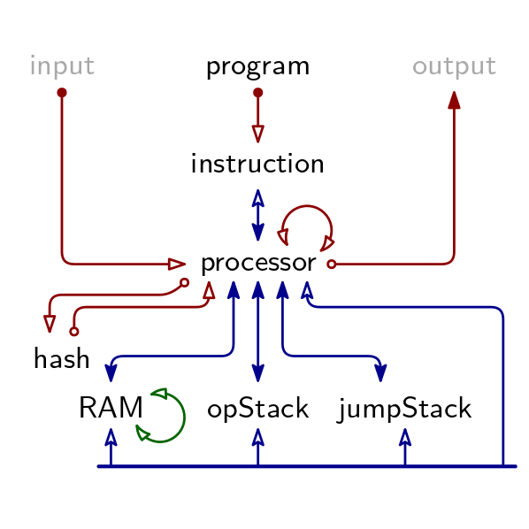

# Algebraic Execution Tables

There are 8 Arithmetic Execution Tables in TritonVM.
Their relation is described by below figure.
A red arrow indicates an Evaluation Argument, a blue line indicates a Permutation Argument.

Public (but not secret!) input and output are given to the Verifier explicitly.
As a consequence, neither the input nor the output symbols are recorded in a table.
Correct use of public input (respectively, output) in the Processor is ensured through an Evaluation Argument.
Given the list of input (or output) symbols, the verifier can compute the Evaluation Argument's terminal explicitly, and consequently compare it to the corresponding terminal in the Processor Table.

Despite the fact that neither public input nor output have a dedicated table, them having Evaluation Arguments with the Processor Table justifies their appearance in above figure.

## Padding

For reasons of computational efficiency, it is beneficial that an Algebraic Execution Table's height equals a power of 2.
To this end, tables are padded.
The height $h$ of the longest AET determines the padded height for all tables, which is $2^{\lceil\log_2 h\rceil}$.
