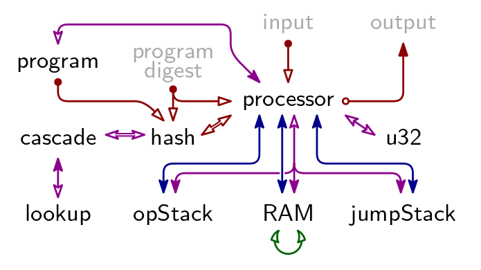

# Arithmetization

An arithmetization defines two things:

1. algebraic execution tables (AETs), and
1. arithmetic intermediate representation (AIR) constraints.

For Triton VM, the execution trace is spread over multiple tables.
These tables are linked by [various cryptographic arguments](table-linking.md).
This division allows for a separation of concerns.
For example, the main processor's trace is recorded in the [Processor Table](processor-table.md).
The main processor can delegate the execution of somewhat-difficult-to-arithmetize instructions like [`hash`](instructions.md#hash) or [`xor`](instructions.md#xor) to a co-processor.
The arithmetization of the co-processor is largely independent from the main processor and recorded in its separate trace.
For example, [instructions relating to hashing](instructions.md#hashing) are executed by the hash co-processor.
Its trace is recorded in the [Hash Table](hash-table.md).
Similarly, [bitwise instructions](instructions.md#bitwise-arithmetic) are executed by the u32 co-processor, and the corresponding trace recorded in the [U32 Table](u32-table.md).
Another example for the separation of concerns is [memory consistency](memory-consistency.md), the bulk of which is delegated to the [Operational Stack Table](operational-stack-table.md), [RAM Table](random-access-memory-table.md), and [Jump Stack Table](jump-stack-table.md).

## Algebraic Execution Tables

There are 9 Arithmetic Execution Tables in TritonVM.
Their relation is described by below figure.
A a blue arrow indicates a [Permutation Argument](permutation-argument.md), a red arrow indicates an [Evaluation Argument](evaluation-argument.md), a purple arrow indicates a [Lookup Argument](lookup-argument.md), and the green arrow is the [Contiguity Argument](contiguity-of-memory-pointer-regions.md).

The grayed-out elements “program digest”, “input”, and “output” are not AETs but publicly available information.
Together, they constitute the claim for which Triton VM produces a proof.
See “[Arguments Using Public Information](arithmetization.md#arguments-using-public-information)” and “[Program Attestation](program-attestation.md)” for the [Evaluation Argument](evaluation-argument.md)s with which they are linked into the rest of the proof system.

### Main Tables

The values of all registers, and consequently the elements on the stack, in memory, and so on, are elements of the _B-field_, _i.e._, $\mathbb{F}_p$ where $p$ is the Oxfoi prime, $2^{64}-2^{32}+1$.
All values of columns corresponding to one such register are elements of the B-Field as well.
Together, these columns are referred to as table's _main_ columns, and make up the _main table_.

### Auxiliary Tables

The entries of a table's columns corresponding to [Permutation](permutation-argument.md), [Evaluation](evaluation-argument.md), and [Lookup Arguments](lookup-argument.md) are elements from the _X-field_ $\mathbb{F}_{p^3}$.
These columns are referred to as a table's _auxiliary_ columns, both because the entries are elements of the X-field and because the entries can only be computed using the main tables, through an _auxiliary_ process.
Together, these columns are referred to as a table's _auxiliary_ columns, and make up the _auxiliary table_.

### Padding

For reasons of computational efficiency, it is beneficial that an Algebraic Execution Table's height equals a power of 2.
To this end, tables are padded.
The height $h$ of the longest AET determines the padded height for all tables, which is $2^{\lceil\log_2 h\rceil}$.

## Arithmetic Intermediate Representation

For each table, up to four lists containing constraints of different type are given:

1. Initial Constraints, defining values in a table's first row,
1. Consistency Constraints, establishing consistency within any given row,
1. Transition Constraints, establishing the consistency of two consecutive rows in relation to each other, and
1. Terminal Constraints, defining values in a table's last row.

Together, all these constraints constitute the AIR constraints.

## Arguments Using Public Information

Triton VM uses a number of public arguments.
That is, one side of the link can be computed by the verifier using publicly available information;
the other side of the link is verified through one or more AIR constraints.

The two most prominent instances of this are public input and output:
both are given to the verifier explicitly.
The verifier can compute the terminal of an [Evaluation Argument](evaluation-argument.md) using public input (respectively, output).
In the [Processor Table](processor-table.md), AIR constraints guarantee that the used input (respectively, output) symbols are accumulated similarly.
Comparing the two terminal values establishes that use of public input (respectively, production of public output) was integral.

The third public argument establishes correctness of the [Lookup Table](lookup-table.md), and is explained there.
The fourth public argument relates to [program attestation](program-attestation.md), and is also explained on its corresponding page.
