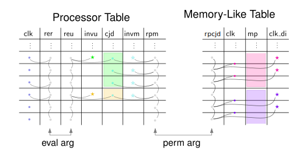

# Clock Jump Differences and Inner Sorting

The previous sections show how it is proven that in the JumpStack, OpStack, and RAM Tables, the regions of constant memory pointer are contiguous. The next step is to prove that within each contiguous region of constant memory pointer, the rows are sorted for clock cycle. That is the topic of this section.

The problem arises from *clock jumps*, which describes the phenomenon when the clock cycle increases by more than 1 even though the memory pointer does not change.
If arbitrary jumps were allowed, nothing would prevent the cheating prover from using a table where higher rows correspond to later states, giving rise to an exploitable attack.
So it must be shown that every clock jump is directed forward and not backward.

Our strategy is to show that the *difference*, *i.e.*, the next clock cycle minus the current clock cycle, is itself a clock cycle.
Recall that the Processor Table's clock cycles run from 0 to $T-1$.
Therefore, a forward directed clock jump difference is in $F = \lbrace 1, \dots, T - 1 \rbrace \subseteq \mathbb{F}_p$, whereas a backward directed clock jump's difference is in $B = \lbrace -f \mid f \in F \rbrace = \lbrace 1 - T, \dots, -1 \rbrace \subseteq \mathbb{F}_p$.
No other clock jump difference can occur.
If $T \ll p/2$, there is no overlap between sets $F$ and $B$.
As a result, in this regime, showing that a clock jump difference is in $F$ guarantees that the jump is forward-directed.

The set of values in the Processor Table's clock cycle column is $F \cup \lbrace 0 \rbrace$.
Standard subset arguments can show that the clock jump differences are elements of that column.
However, it is cumbersome to repeat this argument for three separate tables. What is described here is a construction that combines all three memory-like tables and generates one lookup in the Processor Table's `clk` column. It requires

 - one base column in each memory-like table,
 - one extension column in each memory-like table,
 - four base columns in the Processor Table, and
 - three extension columns in the Processor Table.

## Intuition

 - In order to treat differences in the clock cycle column of magnitude 1 separately, each memory-like table needs an extra base column `clk_di`, which holds the inverse of two consecutive rows' cycle count minus 1, *i.e.*, `clk' - clk - 1`, if that inverse exists, and 0 otherwise.
 - A multi-table permutation argument establishes that all clock jump differences (*cjd*s) greater than 1 are contained in a new column `cjd` of the Processor Table.
 Every memory-like table needs one extension column “running product of clock jump differences” `rpcjd` and the Processor Table needs one matching extension column “running product of clock jump differences with multiplicities” `rpm` to effect this permutation argument.
 - In addition to the extension column computing the running product, the Processor Table needs an inverse column `invm` to help select all *nonzero* `cjd`s, and thus skip padding rows. The abbreviation *invm* is short for inverse-with-multiplicities.
 - An inverse column `invu` in the Processor Table allows for selecting the first row of every contiguous region of `cjd`.
 The abbreviation *invu* is short for unique-inverse.
 - An evaluation argument establishes that a selection of clock cycles and the unique clock jump differences are identical lists.
 This evaluation argument requires two more extension columns on the Processor Table: `rer` computes the running evaluation for the *relevant* clock cycles, whereas `reu` computes the running evaluation for the *unique* clock jump differences.



## Memory-like Tables

Here are the constraints for the RAM Table. The constraints for the other two tables are analogous and are therefore omitted from this section. Where necessary, the suffices `_ram`, `_js`, and `_os` disambiguate between the RAM Table, JumpStack Table, and OpStack Table, respectively.

Use `mp` to abstractly refer to the memory pointer. Depending on the table, that would be `ramp`, `jsp`, or `osp`. Extension column `rpcjd` computes a running product. It starts with 1, giving rise to the initial constraint `rpcjd - 1`.

The transition constraint enforces the accumulation of a factor `(α - clk' + clk)` whenever the memory pointer is the same or the clock jump difference is greater than 1.
If the memory pointer is changed or the clock jump difference is exactly 1, the same running product is carried to the next row.
Expressed in Boolean logic:

```
    clk' - clk ≠ 1 ∧ mp' = mp ⇒ rpcjd' = rpcjd ⋅ (α - (clk' - clk))
    clk' - clk = 1 ∨ mp' ≠ mp ⇒ rp' = rp
```

The corresponding transition constraint is

```
(clk' - clk - 1) ⋅ (1 - (mp' - mp) ⋅ iord) ⋅ (rpcjd' - rpcjd ⋅ (α - (clk' - clk)))
  + (1 - (clk' - clk - 1) ⋅ clk_di) ⋅ (rpcjd' - rpcjd)
  + (mp' - mp) ⋅ (rpcjd' - rpcjd).
```

Note that `iord` is the difference inverse of the RAM Table but for the other two tables this factor can be dropped since the corresponding memory pointer can only change by either 0 or 1 between consecutive rows.

The column `clk_di` contains the inverse-or-zero of the two consecutive clocks, minus one.
This consistency requirement induces two transition constraints:

 - `(clk' - clk - 1) ⋅ (1 - (clk' - clk - 1) ⋅ clk_di)`
 - `clk_di ⋅ (1 - (clk' - clk - 1) ⋅ clk_di)`

## Clock Jump Differences with Multiplicities in the Processor Table

All clock jump differences (that are greater than 1) of all the memory-like tables are listed in the `cjd` column of the Processor Table.
The values are sorted and the padding inserts zeros at the bottom of this column.

Note that this CJD padding is independent from the standard padding that is applied to all tables to make them the same height and to make this height a power of two. This CJD padding applies only to the `cjd` column and does not add new rows to the table.

This cross-table relation comes with another extension column, this time in the Processor Table, that computes a running product. This column is denoted by `rpm`.
This running product accumulates a factor `(α - cjd)` in every row where `cjd ≠ 0`.
Column `invm` (for *inverse-with-multiplicities*), which is the inverse-or-zero of `cjd`, allows writing inequality `cjd ≠ 0` as a polynomial of low degree.

The first factor is accumulated in the first row, giving rise to initial constraint `cjd ⋅ (rpm - (α - cjd)) + (1 - invm ⋅ cjd) ⋅ (rpm - 1)`.

The transition constraint is `cjd ⋅ (rpm' - rpm ⋅ (α - cjd)) + (1 - invm ⋅ cjd) ⋅ (rpm' - rpm)`.

The consistency constraints for the inverse are

 - `cjd ⋅ (1 - cjd ⋅ invm)`
 - `invm ⋅ (1 - cjd ⋅ invm)`.

The terminal value of this column must be equal to the terminal values of the matching running products of the memory-like tables. The cross-table terminal constraint is therefore: `rpm - rpcjd_ram ⋅ rpcjd_js ⋅ rpcjd_os`.

## Total Number of Clock Jump Differences with Multiplicities

Recall that the Processor Table has length $T$.
An honest prover can convince the verifier only if the total number of clock jump differences accumulated by the running product `rpm` is no greater than $T$, independent of the executed program.

If, in the Processor Table, some memory pointer does not change between two consecutive clock cycles, the clock jump difference this produces in the corresponding memory-like table is 1.
Clock jump differences of exactly 1 are treated explicitly and do not require a lookup, *i.e.*, do not contribute a factor to `rpm`.
Thus, `rpm` accumulates at most $T$ factors if all instructions change at most one of the three memory pointers.
This is indeed the case.
The table [“Modified Memory Pointers by Instruction”](modified-memory-pointers-by-instruction.md) lists all instructions and the memory pointers they change.

## Unique Clock Jump Differences in the Processor Table

As described earlier, `invu` is used to select the first row of regions of constant `cjd`. The expression `invu * (cjd' - cjd)` is 1 in such rows.

Using this indicator, we build a running evaluation that accumulates one step of evaluation relative to `cjd` for each contiguous region, excluding the padding region. The clock jump differences accumulated in this manner are unique, giving rise to the column's name: `reu`, short for *running evaluation* over *unique* cjd's.

The first clock jump difference is accumulated in the first row, giving rise to the initial constraint `reu - β - cjd`.

The running evaluation accumulates one step of evaluation whenever the indicator bit is set and the new clock jump difference is not padding.
Otherwise, the running evaluation does not change.
Expressed in Boolean logic:

```
    cjd' ≠ cjd ∧ cjd' ≠ 0 ⇒ reu' = β ⋅ reu + cjd'
    cjd' = cjd ∨ cjd' = 0 ⇒ reu' = reu
```

The following transition constraint captures this transition.

```
    (cjd' - cjd) ⋅ cjd' ⋅ (reu' - β ⋅ reu - cjd')
  + (1 - invu ⋅ (cjd' - cjd)) ⋅ (reu' - reu)
  + (1 - cjd' ⋅ invm') ⋅ (reu' - reu)
```

To verify that the indicator is correctly indicating the first row of every contiguous region, we need `invu` to contain the inverse-or-zero of every consecutive pair of $\mathsf{cjd}$ values. This consistency induces two transition constraints:

 - `invu ⋅ (1 - invu ⋅ (cjd' - cjd))`
 - `(cjd' - cjd) ⋅ (1 - invu ⋅ (cjd' - cjd))`

## Relevant Clock Cycles in the Processor Table

Assume the prover knows when the clock cycle `clk` is also *some* jump in a memory-like table and when it is not. Then it can apply the right running evaluation step as necessary. The prover computes this running evaluation in a column called `rer`, short for *running evaluation* over *relevant* clock cycles.

Since 0 is never a valid clock jump difference, the initial value is 1, giving rise to the initial constraint: `rer - 1`.

In every row, either the running evaluation step is applied, or else the running evaluation remains the same: `(rer' - rer) ⋅ (rer' - β ⋅ rer - clk)`.

The terminal value must be identical to the running evaluation of "Relevant Clock Jumps". This gives rise to the terminal constraint:  `rer - reu`

Whether to apply the evaluation step or not does not need to be constrained since if the prover fails to include certain rows he will have a harder (not easier) time convincing the verifier.
