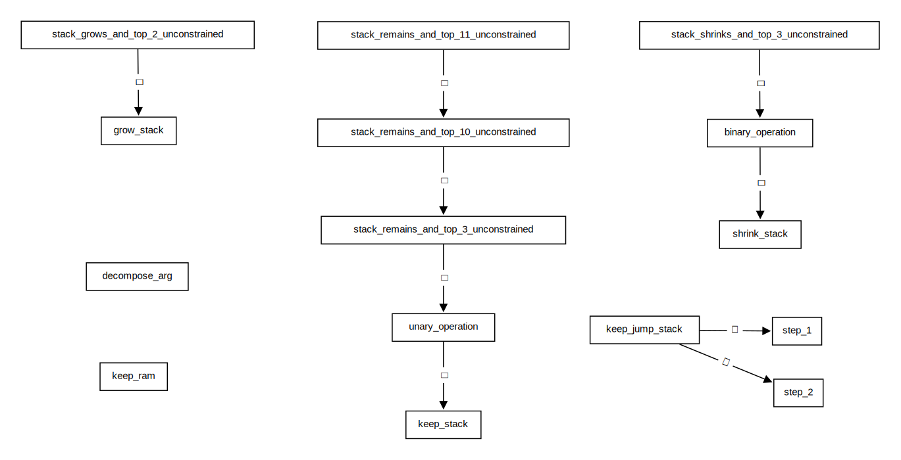

# Instruction Groups

Some transition constraints are shared across some, or even many instructions.
For example, most instructions must not change the jump stack.
Likewise, most instructions must not change RAM.
To simplify presentation of the instruction-specific transition constraints, these common constraints are grouped together and aliased.
Continuing above example, instruction group `keep_jump_stack` contains all transition constraints to ensure that the jump stack remains unchanged.

The next section treats each instruction group in detail.
The following table lists and briefly explains all instruction groups.

| group name                               | description                                                                                                                                                 |
|:-----------------------------------------|:------------------------------------------------------------------------------------------------------------------------------------------------------------|
| `decompose_arg`                          | instruction's argument held in `nia` is binary decomposed into helper registers `hv0` through `hv3`                                                         |
| `keep_ram`                               | RAM does not change, _i.e._,registers `ramp` and `ramv` do not change                                                                                       |
| `keep_jump_stack`                        | jump stack does not change, _i.e._, registers `jsp`, `jso`, and `jsd` do not change                                                                         |
| `step_1`                                 | jump stack does not change and instruction pointer `ip` increases by 1                                                                                      |
| `step_2`                                 | jump stack does not change and instruction pointer `ip` increases by 2                                                                                      |
| `stack_grows_and_top_2_unconstrained`    | operational stack elements starting from `st1` are shifted down by one position, highest two elements of the resulting stack are unconstrained              |
| `grow_stack`                             | operational stack elements are shifted down by one position, top element of the resulting stack is unconstrained                                            |
| `stack_remains_and_top_11_unconstrained` | operational stack's top 11 elements are unconstrained, rest of stack remains unchanged                                                                      |
| `stack_remains_and_top_10_unconstrained` | operational stack's top 10 elements are unconstrained, rest of stack remains unchanged                                                                      |
| `stack_remains_and_top_3_unconstrained`  | operational stack's top 3 elements are unconstrained, rest of stack remains unchanged                                                                       |
| `unary_operation`                        | operational stack's top-most element is unconstrained, rest of stack remains unchanged                                                                      |
| `keep_stack`                             | operational stack remains unchanged                                                                                                                         |
| `stack_shrinks_and_top_3_unconstrained`  | operational stack elements starting from `st3` are shifted up by one position, highest three elements of the resulting stack are unconstrained. Needs `hv3` |
| `binary_operation`                       | operational stack elements starting from `st2` are shifted up by one position, highest two elements of the resulting stack are unconstrained. Needs `hv3`   |
| `shrink_stack`                           | operational stack elements starting from `st1` are shifted up by one position. Needs `hv3`                                                                  |

Below figure gives a comprehensive overview over the subset relation between all instruction groups.

A summary of all instructions and which groups they are part of is given in the following table.

| instruction      | `decompose_arg` | `keep_ram` | `keep_jump_stack` | `step_1` | `step_2` | `stack_grows_and_top_2_unconstrained` | `grow_stack` | `stack_remains_and_top_11_unconstrained` | `stack_remains_and_top_10_unconstrained` | `stack_remains_and_top_3_unconstrained` | `unary_operation` | `keep_stack` | `stack_shrinks_and_top_3_unconstrained` | `binary_operation` | `shrink_stack` |
|:-----------------|:---------------:|:----------:|:-----------------:|:--------:|:--------:|:-------------------------------------:|:------------:|:----------------------------------------:|:----------------------------------------:|:---------------------------------------:|:-----------------:|:------------:|:---------------------------------------:|:------------------:|:--------------:|
| `pop`            |                 |     x      |                   |    x     |          |                                       |              |                                          |                                          |                                         |                   |              |                                         |                    |       x        |
| `push` + `a`     |                 |     x      |                   |          |    x     |                                       |      x       |                                          |                                          |                                         |                   |              |                                         |                    |                |
| `divine`         |                 |     x      |                   |    x     |          |                                       |      x       |                                          |                                          |                                         |                   |              |                                         |                    |                |
| `dup` + `i`      |        x        |     x      |                   |          |    x     |                                       |      x       |                                          |                                          |                                         |                   |              |                                         |                    |                |
| `swap` + `i`     |        x        |     x      |                   |          |    x     |                                       |              |                                          |                                          |                                         |                   |              |                                         |                    |                |
| `nop`            |                 |     x      |                   |    x     |          |                                       |              |                                          |                                          |                                         |                   |      x       |                                         |                    |                |
| `skiz`           |                 |     x      |         x         |          |          |                                       |              |                                          |                                          |                                         |                   |              |                                         |                    |       x        |
| `call` + `d`     |                 |     x      |                   |          |          |                                       |              |                                          |                                          |                                         |                   |      x       |                                         |                    |                |
| `return`         |                 |     x      |                   |          |          |                                       |              |                                          |                                          |                                         |                   |      x       |                                         |                    |                |
| `recurse`        |                 |     x      |         x         |          |          |                                       |              |                                          |                                          |                                         |                   |      x       |                                         |                    |                |
| `assert`         |                 |     x      |                   |    x     |          |                                       |              |                                          |                                          |                                         |                   |              |                                         |                    |       x        |
| `halt`           |                 |     x      |                   |    x     |          |                                       |              |                                          |                                          |                                         |                   |      x       |                                         |                    |                |
| `read_mem`       |                 |            |                   |    x     |          |                                       |              |                                          |                                          |                                         |         x         |              |                                         |                    |                |
| `write_mem`      |                 |            |                   |    x     |          |                                       |              |                                          |                                          |                                         |                   |      x       |                                         |                    |                |
| `hash`           |                 |     x      |                   |    x     |          |                                       |              |                                          |                    x                     |                                         |                   |              |                                         |                    |                |
| `divine_sibling` |                 |     x      |                   |    x     |          |                                       |              |                    x                     |                                          |                                         |                   |              |                                         |                    |                |
| `assert_vector`  |                 |     x      |                   |    x     |          |                                       |              |                                          |                                          |                                         |                   |      x       |                                         |                    |                |
| `add`            |                 |     x      |                   |    x     |          |                                       |              |                                          |                                          |                                         |                   |              |                                         |         x          |                |
| `mul`            |                 |     x      |                   |    x     |          |                                       |              |                                          |                                          |                                         |                   |              |                                         |         x          |                |
| `invert`         |                 |     x      |                   |    x     |          |                                       |              |                                          |                                          |                                         |         x         |              |                                         |                    |                |
| `eq`             |                 |     x      |                   |    x     |          |                                       |              |                                          |                                          |                                         |                   |              |                                         |         x          |                |
| `lsb`            |                 |     x      |                   |    x     |          |                   x                   |              |                                          |                                          |                                         |                   |              |                                         |                    |                |
| `split`          |                 |     x      |                   |    x     |          |                   x                   |              |                                          |                                          |                                         |                   |              |                                         |                    |                |
| `lt`             |                 |     x      |                   |    x     |          |                                       |              |                                          |                                          |                                         |                   |              |                                         |         x          |                |
| `and`            |                 |     x      |                   |    x     |          |                                       |              |                                          |                                          |                                         |                   |              |                                         |         x          |                |
| `xor`            |                 |     x      |                   |    x     |          |                                       |              |                                          |                                          |                                         |                   |              |                                         |         x          |                |
| `log2floor`      |                 |     x      |                   |    x     |          |                                       |              |                                          |                                          |                                         |         x         |              |                                         |                    |                |
| `pow`            |                 |     x      |                   |    x     |          |                                       |              |                                          |                                          |                                         |                   |              |                                         |         x          |                |
| `div`            |                 |     x      |                   |    x     |          |                                       |              |                                          |                                          |                    x                    |                   |              |                                         |                    |                |
| `xxadd`          |                 |     x      |                   |    x     |          |                                       |              |                                          |                                          |                    x                    |                   |              |                                         |                    |                |
| `xxmul`          |                 |     x      |                   |    x     |          |                                       |              |                                          |                                          |                    x                    |                   |              |                                         |                    |                |
| `xinvert`        |                 |     x      |                   |    x     |          |                                       |              |                                          |                                          |                    x                    |                   |              |                                         |                    |                |
| `xbmul`          |                 |     x      |                   |    x     |          |                                       |              |                                          |                                          |                                         |                   |              |                    x                    |                    |                |
| `read_io`        |                 |     x      |                   |    x     |          |                                       |      x       |                                          |                                          |                                         |                   |              |                                         |                    |                |
| `write_io`       |                 |     x      |                   |    x     |          |                                       |              |                                          |                                          |                                         |                   |              |                                         |                    |       x        |

## Indicator Polynomials `ind_i(hv3, hv2, hv1, hv0)`

In this and the following sections, a register marked with a `'` refers to the next state of that register.
For example, `st0' = st0 + 2` means that stack register `st0` is incremented by 2.
An alternative view for the same concept is that registers marked with `'` are those of the next row in the table.

For instructions [`dup`](instruction-specific-transition-constraints.md#instruction-dup--i) and [`swap`](instruction-specific-transition-constraints.md#instruction-swap--i), it is beneficial to have polynomials that evaluate to 1 if the instruction's argument `i` is a specific value, and to 0 otherwise.
This allows indicating which registers are constraint, and in which way they are, depending on `i`.
This is the purpose of the _indicator polynomials_ `ind_i`.
Evaluated on the binary decomposition of `i`, they show the behavior described above.

For example, take `i = 13`.
The corresponding binary decomposition is `(hv3, hv2, hv1, hv0) = (1, 1, 0, 1)`.
Indicator polynomial `ind_13(hv3, hv2, hv1, hv0)` is `hv3·hv2·(1 - hv1)·hv0`.
It evaluates to 1 on `(1, 1, 0, 1)`, i.e., `ind_13(1, 1, 0, 1) = 1`.
Any other indicator polynomial, like `ind_7`, evaluates to 0 on `(1, 1, 0, 1)`.
Likewise, the indicator polynomial for 13 evaluates to 0 for any other argument.

Below, you can find a list of all 16 indicator polynomials.

1.  `ind_0(hv3, hv2, hv1, hv0) = (1 - hv3)·(1 - hv2)·(1 - hv1)·(1 - hv0)`
1.  `ind_1(hv3, hv2, hv1, hv0) = (1 - hv3)·(1 - hv2)·(1 - hv1)·hv0`
1.  `ind_2(hv3, hv2, hv1, hv0) = (1 - hv3)·(1 - hv2)·hv1·(1 - hv0)`
1.  `ind_3(hv3, hv2, hv1, hv0) = (1 - hv3)·(1 - hv2)·hv1·hv0`
1.  `ind_4(hv3, hv2, hv1, hv0) = (1 - hv3)·hv2·(1 - hv1)·(1 - hv0)`
1.  `ind_5(hv3, hv2, hv1, hv0) = (1 - hv3)·hv2·(1 - hv1)·hv0`
1.  `ind_6(hv3, hv2, hv1, hv0) = (1 - hv3)·hv2·hv1·(1 - hv0)`
1.  `ind_7(hv3, hv2, hv1, hv0) = (1 - hv3)·hv2·hv1·hv0`
1.  `ind_8(hv3, hv2, hv1, hv0) = hv3·(1 - hv2)·(1 - hv1)·(1 - hv0)`
1.  `ind_9(hv3, hv2, hv1, hv0) = hv3·(1 - hv2)·(1 - hv1)·hv0`
1. `ind_10(hv3, hv2, hv1, hv0) = hv3·(1 - hv2)·hv1·(1 - hv0)`
1. `ind_11(hv3, hv2, hv1, hv0) = hv3·(1 - hv2)·hv1·hv0`
1. `ind_12(hv3, hv2, hv1, hv0) = hv3·hv2·(1 - hv1)·(1 - hv0)`
1. `ind_13(hv3, hv2, hv1, hv0) = hv3·hv2·(1 - hv1)·hv0`
1. `ind_14(hv3, hv2, hv1, hv0) = hv3·hv2·hv1·(1 - hv0)`
1. `ind_15(hv3, hv2, hv1, hv0) = hv3·hv2·hv1·hv0`

## Group `decompose_arg`

### Description

1. The helper variables are the decomposition of the instruction's argument, which is held in register `nia`.
1. The helper variable `hv0` is either 0 or 1.
1. The helper variable `hv1` is either 0 or 1.
1. The helper variable `hv2` is either 0 or 1.
1. The helper variable `hv3` is either 0 or 1.

### Polynomials

1. `nia - (8·hv3 + 4·hv2 + 2·hv1 + hv0)`
1. `hv0·(hv0 - 1)`
1. `hv1·(hv1 - 1)`
1. `hv2·(hv2 - 1)`
1. `hv3·(hv3 - 1)`

## Group `keep_ram`

### Description

1. The RAM pointer `ramp` does not change.
1. The RAM value `ramv` does not change.

### Polynomials

1. `ramp' - ramp`
1. `ramv' - ramv`

## Group `keep_jump_stack`

### Description

1. The jump stack pointer `jsp` does not change.
1. The jump stack origin `jso` does not change.
1. The jump stack destination `jsd` does not change.

### Polynomials

1. `jsp' - jsp`
1. `jso' - jso`
1. `jsd' - jsd`

## Group `step_1`

Contains all constraints from instruction group `keep_jump_stack`, and additionally:

### Description

1. The instruction pointer increments by 1.

### Polynomials

1. `ip' - (ip + 1)`

## Group `step_2`

Contains all constraints from instruction group `keep_jump_stack`, and additionally:

### Description

1. The instruction pointer increments by 2.

### Polynomials

1. `ip' - (ip + 2)`

## Group `stack_grows_and_top_2_unconstrained`

### Description

1. The stack element in `st1` is moved into `st2`.
1. The stack element in `st2` is moved into `st3`.
1. The stack element in `st3` is moved into `st4`.
1. The stack element in `st4` is moved into `st5`.
1. The stack element in `st5` is moved into `st6`.
1. The stack element in `st6` is moved into `st7`.
1. The stack element in `st7` is moved into `st8`.
1. The stack element in `st8` is moved into `st9`.
1. The stack element in `st9` is moved into `st10`.
1. The stack element in `st10` is moved into `st11`.
1. The stack element in `st11` is moved into `st12`.
1. The stack element in `st12` is moved into `st13`.
1. The stack element in `st13` is moved into `st14`.
1. The stack element in `st14` is moved into `st15`.
1. The stack element in `st15` is moved to the top of OpStack underflow, i.e., `osv`.
1. The OpStack pointer is incremented by 1.

### Polynomials

1. `st2' - st1`
1. `st3' - st2`
1. `st4' - st3`
1. `st5' - st4`
1. `st6' - st5`
1. `st7' - st6`
1. `st8' - st7`
1. `st9' - st8`
1. `st10' - st9`
1. `st11' - st10`
1. `st12' - st11`
1. `st13' - st12`
1. `st14' - st13`
1. `st15' - st14`
1. `osv' - st15`
1. `osp' - (osp + 1)`

## Group `grow_stack`

Contains all constraints from instruction group `stack_grows_and_top_2_unconstrained`, and additionally:

### Description

1. The stack element in `st0` is moved into `st1`.

### Polynomials

1. `st1' - st0`

## Group `stack_remains_and_top_11_unconstrained`

### Description

1. The stack element in `st11` does not change.
1. The stack element in `st12` does not change.
1. The stack element in `st13` does not change.
1. The stack element in `st14` does not change.
1. The stack element in `st15` does not change.
1. The top of the OpStack underflow, i.e., `osv`, does not change.
1. The OpStack pointer does not change.

### Polynomials

1. `st11' - st11`
1. `st12' - st12`
1. `st13' - st13`
1. `st14' - st14`
1. `st15' - st15`
1. `osv' - osv`
1. `osp' - osp`

## Group `stack_remains_and_top_10_unconstrained`

Contains all constraints from instruction group `stack_remains_and_top_11_unconstrained`, and additionally:

### Description

1. The stack element in `st10` does not change.

### Polynomials

1. `st10' - st10`

## Group `stack_remains_and_top_3_unconstrained`

Contains all constraints from instruction group `stack_remains_and_top_10_unconstrained`, and additionally:

### Description

1. The stack element in `st3` does not change.
1. The stack element in `st4` does not change.
1. The stack element in `st5` does not change.
1. The stack element in `st6` does not change.
1. The stack element in `st7` does not change.
1. The stack element in `st8` does not change.
1. The stack element in `st9` does not change.

### Polynomials

1. `st3' - st3`
1. `st4' - st4`
1. `st5' - st5`
1. `st6' - st6`
1. `st7' - st7`
1. `st8' - st8`
1. `st9' - st9`

## Group `unary_operation`

Contains all constraints from instruction group `stack_remains_and_top_3_unconstrained`, and additionally:

### Description

1. The stack element in `st1` does not change.
1. The stack element in `st2` does not change.

### Polynomials

1. `st1' - st1`
1. `st2' - st2`

## Group `keep_stack`

Contains all constraints from instruction group `unary_operation`, and additionally:

### Description

1. The stack element in `st0` does not change.

### Polynomials

1. `st0' - st0`

## Group `stack_shrinks_and_top_3_unconstrained`

This instruction group requires helper variable `hv3` to hold the multiplicative inverse of `(osp - 16)`.
In effect, this means that the OpStack pointer can only be decremented if it is not 16, i.e., if OpStack Underflow Memory is not empty.
Since the stack can only change by one element at a time, this prevents stack underflow.

### Description

1. The stack element in `st4` is moved into `st3`.
1. The stack element in `st5` is moved into `st4`.
1. The stack element in `st6` is moved into `st5`.
1. The stack element in `st7` is moved into `st6`.
1. The stack element in `st8` is moved into `st7`.
1. The stack element in `st9` is moved into `st8`.
1. The stack element in `st10` is moved into `st9`.
1. The stack element in `st11` is moved into `st10`.
1. The stack element in `st12` is moved into `st11`.
1. The stack element in `st13` is moved into `st12`.
1. The stack element in `st14` is moved into `st13`.
1. The stack element in `st15` is moved into `st14`.
1. The stack element at the top of OpStack underflow, i.e., `osv`, is moved into `st15`.
1. The OpStack pointer is decremented by 1.
1. The helper variable register `hv3` holds the inverse of `(osp - 16)`.

### Polynomials

1. `st3' - st4`
1. `st4' - st5`
1. `st5' - st6`
1. `st6' - st7`
1. `st7' - st8`
1. `st8' - st9`
1. `st9' - st10`
1. `st10' - st11`
1. `st11' - st12`
1. `st12' - st13`
1. `st13' - st14`
1. `st14' - st15`
1. `st15' - osv`
1. `osp' - (osp - 1)`
1. `(osp - 16)·hv3 - 1`

## Group `binary_operation`

Contains all constraints from instruction group `stack_shrinks_and_top_3_unconstrained`, and additionally:

### Description

1. The stack element in `st2` is moved into `st1`.
1. The stack element in `st3` is moved into `st2`.

### Polynomials

1. `st1' - st2`
1. `st2' - st3`

## Group `shrink_stack`

Contains all constraints from instruction group `binary_operation`, and additionally:

### Description

1. The stack element in `st1` is moved into `st0`.

### Polynomials

1. `st0' - st1`
