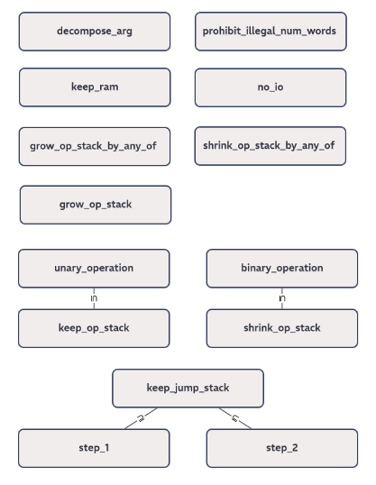

# Instruction Groups

Some transition constraints are shared across some, or even many instructions.
For example, most instructions must not change the jump stack.
Likewise, most instructions must not change RAM.
To simplify presentation of the instruction-specific transition constraints, these common constraints are grouped together and aliased.
Continuing above example, instruction group `keep_jump_stack` contains all transition constraints to ensure that the jump stack remains unchanged.

The next section treats each instruction group in detail.
The following table lists and briefly explains all instruction groups.

| group name                   | description                                                                                                                                              |
|:-----------------------------|:---------------------------------------------------------------------------------------------------------------------------------------------------------|
| `decompose_arg`              | instruction's argument held in `nia` is binary decomposed into helper registers `hv0` through `hv3`                                                      |
| `prohibit_illegal_num_words` | constrain the instruction's argument `n` to 1 ⩽ `n` ⩽ 5                                                                                                  |
| `no_io`                      | the running evaluations for public input & output remain unchanged                                                                                       |
| `keep_ram`                   | RAM does not change, _i.e._, the running product of the [Permutation Argument](permutation-argument.md) with the RAM Table remains unchanged             |
| `keep_jump_stack`            | jump stack does not change, _i.e._, registers `jsp`, `jso`, and `jsd` do not change                                                                      |
| `step_1`                     | jump stack does not change and instruction pointer `ip` increases by 1                                                                                   |
| `step_2`                     | jump stack does not change and instruction pointer `ip` increases by 2                                                                                   |
| `grow_op_stack`              | op stack elements are shifted down by one position, top element of the resulting stack is unconstrained                                                  |
| `grow_op_stack_by_any_of`    | op stack elements are shifted down by `n` positions, top `n` elements of the resulting stack are unconstrained, where `n` is the instruction's argument  |
| `unary_operation`            | op stack's top-most element is unconstrained, rest of stack remains unchanged                                                                            |
| `keep_op_stack`              | op stack remains unchanged, _i.e._, the running product of the [Permutation Argument](permutation-argument.md) with the Op Stack Table remains unchanged |
| `binary_operation`           | op stack elements starting from `st2` are shifted up by one position, highest two elements of the resulting stack are unconstrained                      |
| `shrink_op_stack`            | op stack elements starting from `st1` are shifted up by one position                                                                                     |
| `shrink_op_stack_by_any_of`  | op stack elements starting from `stn` are shifted up by one position, where `n` is the instruction's argument                                            |

Below figure gives a comprehensive overview over the subset relation between all instruction groups.

<!-- Created using https://flowchart.fun, not recommended anymore since they changed their subscription model which is not worth our limited use -->

A summary of all instructions and which groups they are part of is given in the following table.

| instruction       | `decompose_arg` | `prohibit_illegal_num_words` | `no_io` | `keep_ram` | `keep_jump_stack` | `step_1` | `step_2` | `grow_op_stack` | `grow_op_stack_by_any_of` | `unary_operation` | `keep_op_stack` | `binary_operation` | `shrink_op_stack` | `shrink_op_stack_by_any_of` |
|:------------------|:---------------:|:----------------------------:|:-------:|:----------:|:-----------------:|:--------:|:--------:|:---------------:|:-------------------------:|:-----------------:|:---------------:|:------------------:|:-----------------:|:---------------------------:|
| `pop` + `n`       |        x        |              x               |    x    |     x      |                   |          |    x     |                 |                           |                   |                 |                    |                   |              x              |
| `push` + `a`      |                 |                              |    x    |     x      |                   |          |    x     |        x        |                           |                   |                 |                    |                   |                             |
| `divine`  + `n`   |        x        |              x               |    x    |     x      |                   |          |    x     |                 |             x             |                   |                 |                    |                   |                             |
| `dup`  + `i`      |        x        |                              |    x    |     x      |                   |          |    x     |        x        |                           |                   |                 |                    |                   |                             |
| `swap` + `i`      |        x        |                              |    x    |     x      |                   |          |    x     |                 |                           |                   |                 |                    |                   |                             |
| `nop`             |                 |                              |    x    |     x      |                   |    x     |          |                 |                           |                   |        x        |                    |                   |                             |
| `skiz`            |                 |                              |    x    |     x      |         x         |          |          |                 |                           |                   |                 |                    |         x         |                             |
| `call` + `d`      |                 |                              |    x    |     x      |                   |          |          |                 |                           |                   |        x        |                    |                   |                             |
| `return`          |                 |                              |    x    |     x      |                   |          |          |                 |                           |                   |        x        |                    |                   |                             |
| `recurse`         |                 |                              |    x    |     x      |         x         |          |          |                 |                           |                   |        x        |                    |                   |                             |
| `assert`          |                 |                              |    x    |     x      |                   |    x     |          |                 |                           |                   |                 |                    |         x         |                             |
| `halt`            |                 |                              |    x    |     x      |                   |    x     |          |                 |                           |                   |        x        |                    |                   |                             |
| `read_mem` + `n`  |        x        |              x               |    x    |            |                   |          |    x     |                 |             x             |                   |                 |                    |                   |                             |
| `write_mem` + `n` |        x        |              x               |    x    |            |                   |          |    x     |                 |                           |                   |                 |                    |                   |              x              |
| `hash`            |                 |                              |    x    |     x      |                   |    x     |          |                 |                           |                   |                 |                    |                   |                             |
| `divine_sibling`  |                 |                              |    x    |     x      |                   |    x     |          |                 |                           |                   |                 |                    |                   |                             |
| `assert_vector`   |                 |                              |    x    |     x      |                   |    x     |          |                 |                           |                   |                 |                    |                   |                             |
| `sponge_init`     |                 |                              |    x    |     x      |                   |    x     |          |                 |                           |                   |                 |                    |                   |                             |
| `sponge_absorb`   |                 |                              |    x    |     x      |                   |    x     |          |                 |                           |                   |                 |                    |                   |                             |
| `sponge_squeeze`  |                 |                              |    x    |     x      |                   |    x     |          |                 |                           |                   |                 |                    |                   |                             |
| `add`             |                 |                              |    x    |     x      |                   |    x     |          |                 |                           |                   |                 |         x          |                   |                             |
| `mul`             |                 |                              |    x    |     x      |                   |    x     |          |                 |                           |                   |                 |         x          |                   |                             |
| `invert`          |                 |                              |    x    |     x      |                   |    x     |          |                 |                           |         x         |                 |                    |                   |                             |
| `eq`              |                 |                              |    x    |     x      |                   |    x     |          |                 |                           |                   |                 |         x          |                   |                             |
| `split`           |                 |                              |    x    |     x      |                   |    x     |          |                 |                           |                   |                 |                    |                   |                             |
| `lt`              |                 |                              |    x    |     x      |                   |    x     |          |                 |                           |                   |                 |         x          |                   |                             |
| `and`             |                 |                              |    x    |     x      |                   |    x     |          |                 |                           |                   |                 |         x          |                   |                             |
| `xor`             |                 |                              |    x    |     x      |                   |    x     |          |                 |                           |                   |                 |         x          |                   |                             |
| `log_2_floor`     |                 |                              |    x    |     x      |                   |    x     |          |                 |                           |         x         |                 |                    |                   |                             |
| `pow`             |                 |                              |    x    |     x      |                   |    x     |          |                 |                           |                   |                 |         x          |                   |                             |
| `div_mod`         |                 |                              |    x    |     x      |                   |    x     |          |                 |                           |                   |                 |                    |                   |                             |
| `pop_count`       |                 |                              |    x    |     x      |                   |    x     |          |                 |                           |         x         |                 |                    |                   |                             |
| `xxadd`           |                 |                              |    x    |     x      |                   |    x     |          |                 |                           |                   |                 |                    |                   |                             |
| `xxmul`           |                 |                              |    x    |     x      |                   |    x     |          |                 |                           |                   |                 |                    |                   |                             |
| `xinvert`         |                 |                              |    x    |     x      |                   |    x     |          |                 |                           |                   |                 |                    |                   |                             |
| `xbmul`           |                 |                              |    x    |     x      |                   |    x     |          |                 |                           |                   |                 |                    |                   |                             |
| `read_io` + `n`   |        x        |              x               |         |     x      |                   |          |    x     |                 |             x             |                   |                 |                    |                   |                             |
| `write_io` + `n`  |        x        |              x               |         |     x      |                   |          |    x     |                 |                           |                   |                 |                    |                   |              x              |

## Indicator Polynomials `ind_i(hv3, hv2, hv1, hv0)`

In this and the following sections, a register marked with a `'` refers to the next state of that register.
For example, `st0' = st0 + 2` means that stack register `st0` is incremented by 2.
An alternative view for the same concept is that registers marked with `'` are those of the next row in the table.

For instructions like `dup i`, `swap i`, `pop n`, _et cetera_, it is beneficial to have polynomials that evaluate to 1 if the instruction's argument is a specific value, and to 0 otherwise.
This allows indicating which registers are constraint, and in which way they are, depending on the argument.
This is the purpose of the _indicator polynomials_ `ind_i`.
Evaluated on the binary decomposition of `i`, they show the behavior described above.

For example, take `i = 13`.
The corresponding binary decomposition is `(hv3, hv2, hv1, hv0) = (1, 1, 0, 1)`.
Indicator polynomial `ind_13(hv3, hv2, hv1, hv0)` is defined as `hv3·hv2·(1 - hv1)·hv0`.
It evaluates to 1 on `(1, 1, 0, 1)`, i.e., `ind_13(1, 1, 0, 1) = 1`.
Any other indicator polynomial, like `ind_7`, evaluates to 0 on `(1, 1, 0, 1)`.
Likewise, the indicator polynomial for 13 evaluates to 0 for any other argument.

The list of all 16 indicator polynomials is:

0.  `ind_0(hv3, hv2, hv1, hv0) = (1 - hv3)·(1 - hv2)·(1 - hv1)·(1 - hv0)`
1.  `ind_1(hv3, hv2, hv1, hv0) = (1 - hv3)·(1 - hv2)·(1 - hv1)·hv0`
1.  `ind_2(hv3, hv2, hv1, hv0) = (1 - hv3)·(1 - hv2)·hv1·(1 - hv0)`
1.  `ind_3(hv3, hv2, hv1, hv0) = (1 - hv3)·(1 - hv2)·hv1·hv0`
1.  `ind_4(hv3, hv2, hv1, hv0) = (1 - hv3)·hv2·(1 - hv1)·(1 - hv0)`
1.  `ind_5(hv3, hv2, hv1, hv0) = (1 - hv3)·hv2·(1 - hv1)·hv0`
1.  `ind_6(hv3, hv2, hv1, hv0) = (1 - hv3)·hv2·hv1·(1 - hv0)`
1.  `ind_7(hv3, hv2, hv1, hv0) = (1 - hv3)·hv2·hv1·hv0`
1.  `ind_8(hv3, hv2, hv1, hv0) = hv3·(1 - hv2)·(1 - hv1)·(1 - hv0)`
1.  `ind_9(hv3, hv2, hv1, hv0) = hv3·(1 - hv2)·(1 - hv1)·hv0`
1. `ind_10(hv3, hv2, hv1, hv0) = hv3·(1 - hv2)·hv1·(1 - hv0)`
1. `ind_11(hv3, hv2, hv1, hv0) = hv3·(1 - hv2)·hv1·hv0`
1. `ind_12(hv3, hv2, hv1, hv0) = hv3·hv2·(1 - hv1)·(1 - hv0)`
1. `ind_13(hv3, hv2, hv1, hv0) = hv3·hv2·(1 - hv1)·hv0`
1. `ind_14(hv3, hv2, hv1, hv0) = hv3·hv2·hv1·(1 - hv0)`
1. `ind_15(hv3, hv2, hv1, hv0) = hv3·hv2·hv1·hv0`

## Group `decompose_arg`

### Description

1. The helper variables `hv0` through `hv3` are the binary decomposition of the instruction's argument, which is held in register `nia`.
1. The helper variable `hv0` is either 0 or 1.
1. The helper variable `hv1` is either 0 or 1.
1. The helper variable `hv2` is either 0 or 1.
1. The helper variable `hv3` is either 0 or 1.

### Polynomials

1. `nia - (8·hv3 + 4·hv2 + 2·hv1 + hv0)`
1. `hv0·(hv0 - 1)`
1. `hv1·(hv1 - 1)`
1. `hv2·(hv2 - 1)`
1. `hv3·(hv3 - 1)`

## Group `keep_ram`

### Description

1. The running product for the Permutation Argument with the RAM table does not change.

### Polynomials

1. `RunningProductRamTable' - RunningProductRamTable`

## Group `keep_jump_stack`

### Description

1. The jump stack pointer `jsp` does not change.
1. The jump stack origin `jso` does not change.
1. The jump stack destination `jsd` does not change.

### Polynomials

1. `jsp' - jsp`
1. `jso' - jso`
1. `jsd' - jsd`

## Group `step_1`

Contains all constraints from instruction group `keep_jump_stack`, and additionally:

### Description

1. The instruction pointer increments by 1.

### Polynomials

1. `ip' - (ip + 1)`

## Group `step_2`

Contains all constraints from instruction group `keep_jump_stack`, and additionally:

### Description

1. The instruction pointer increments by 2.

### Polynomials

1. `ip' - (ip + 2)`

## Group `grow_op_stack`

### Description

1. The stack element in `st0` is moved into `st1`.
1. The stack element in `st1` is moved into `st2`.
1. The stack element in `st2` is moved into `st3`.
1. The stack element in `st3` is moved into `st4`.
1. The stack element in `st4` is moved into `st5`.
1. The stack element in `st5` is moved into `st6`.
1. The stack element in `st6` is moved into `st7`.
1. The stack element in `st7` is moved into `st8`.
1. The stack element in `st8` is moved into `st9`.
1. The stack element in `st9` is moved into `st10`.
1. The stack element in `st10` is moved into `st11`.
1. The stack element in `st11` is moved into `st12`.
1. The stack element in `st12` is moved into `st13`.
1. The stack element in `st13` is moved into `st14`.
1. The stack element in `st14` is moved into `st15`.
1. The op stack pointer is incremented by 1.
1. The running product for the Op Stack Table absorbs the current row with respect to challenges 🍋, 🍊, 🍉, and 🫒 and indeterminate 🪤.

### Polynomials

1. `st1' - st0`
1. `st2' - st1`
1. `st3' - st2`
1. `st4' - st3`
1. `st5' - st4`
1. `st6' - st5`
1. `st7' - st6`
1. `st8' - st7`
1. `st9' - st8`
1. `st10' - st9`
1. `st11' - st10`
1. `st12' - st11`
1. `st13' - st12`
1. `st14' - st13`
1. `st15' - st14`
1. `op_stack_pointer' - (op_stack_pointer + 1)`
1. `RunningProductOpStackTable' - RunningProductOpStackTable·(🪤 - 🍋·clk - 🍊·ib1 - 🍉·op_stack_pointer - 🫒·st15)`

## Group `unary_operation`

### Description

1. The stack element in `st1` does not change.
1. The stack element in `st2` does not change.
1. The stack element in `st3` does not change.
1. The stack element in `st4` does not change.
1. The stack element in `st5` does not change.
1. The stack element in `st6` does not change.
1. The stack element in `st7` does not change.
1. The stack element in `st8` does not change.
1. The stack element in `st9` does not change.
1. The stack element in `st10` does not change.
1. The stack element in `st11` does not change.
1. The stack element in `st12` does not change.
1. The stack element in `st13` does not change.
1. The stack element in `st14` does not change.
1. The stack element in `st15` does not change.
1. The op stack pointer does not change.
1. The running product for the Op Stack Table remains unchanged.

### Polynomials

1. `st1' - st1`
1. `st2' - st2`
1. `st3' - st3`
1. `st4' - st4`
1. `st5' - st5`
1. `st6' - st6`
1. `st7' - st7`
1. `st8' - st8`
1. `st9' - st9`
1. `st10' - st10`
1. `st11' - st11`
1. `st12' - st12`
1. `st13' - st13`
1. `st14' - st14`
1. `st15' - st15`
1. `op_stack_pointer' - op_stack_pointer`
1. `RunningProductOpStackTable' - RunningProductOpStackTable`

## Group `keep_op_stack`

Contains all constraints from instruction group `unary_operation`, and additionally:

### Description

1. The stack element in `st0` does not change.

### Polynomials

1. `st0' - st0`

## Group `binary_operation`

### Description

1. The stack element in `st2` is moved into `st1`.
1. The stack element in `st3` is moved into `st2`.
1. The stack element in `st4` is moved into `st3`.
1. The stack element in `st5` is moved into `st4`.
1. The stack element in `st6` is moved into `st5`.
1. The stack element in `st7` is moved into `st6`.
1. The stack element in `st8` is moved into `st7`.
1. The stack element in `st9` is moved into `st8`.
1. The stack element in `st10` is moved into `st9`.
1. The stack element in `st11` is moved into `st10`.
1. The stack element in `st12` is moved into `st11`.
1. The stack element in `st13` is moved into `st12`.
1. The stack element in `st14` is moved into `st13`.
1. The stack element in `st15` is moved into `st14`.
1. The op stack pointer is decremented by 1.
1. The running product for the Op Stack Table absorbs clock cycle and instruction bit 1 from the current row as well as op stack pointer and stack element 15 from the next row with respect to challenges 🍋, 🍊, 🍉, and 🫒 and indeterminate 🪤.

### Polynomials

1. `st1' - st2`
1. `st2' - st3`
1. `st3' - st4`
1. `st4' - st5`
1. `st5' - st6`
1. `st6' - st7`
1. `st7' - st8`
1. `st8' - st9`
1. `st9' - st10`
1. `st10' - st11`
1. `st11' - st12`
1. `st12' - st13`
1. `st13' - st14`
1. `st14' - st15`
1. `op_stack_pointer' - (op_stack_pointer - 1)`
1. `RunningProductOpStackTable' - RunningProductOpStackTable·(🪤 - 🍋·clk - 🍊·ib1 - 🍉·op_stack_pointer' - 🫒·st15')`

## Group `shrink_op_stack`

Contains all constraints from instruction group `binary_operation`, and additionally:

### Description

1. The stack element in `st1` is moved into `st0`.

### Polynomials

1. `st0' - st1`
