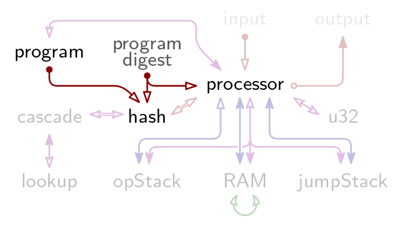

# Program Attestation

“Program attestation” is the notion of cryptographically linking a program to the proof produced by that program's execution.
Informally, program attestation allows Triton VM to prove claims of the form:

> There exists a program with hash digest X that, given input Y, produces output Z.

Without program attestation, Triton VM would only be able to prove claims of the form:

> There exists a program that, given input Y, produces output Z.

The proof system is zero-knowledge with respect to the actual program.
That is, the verifier learns nothing about the program of which correct execution is proven, except the program's digest[^zk].
This property is generally desirable, for example to keep a specific machine learning model secret while being able to prove its correct execution.
However, it can be equally desirable to reveal the program, for example to allow code auditing.
In such cases, the program's source code can be revealed and digest equality can be checked.

As is the case throughout Triton VM, the used hash function is [Tip5][tip5].

## Mechanics

Program attestation is part of initializing Triton VM.
That is, control is passed to the to-be-executed program only after the following steps have been performed:

1. The instructions, located in [program memory](program-table.md), are padded.
The padding follows [Tip5][tip5]'s rules for input of variable length[^input-pad].
1. The padded instructions are copied to the [Hash Table](hash-table.md).
1. The Hash Table computes the program's digest by iterating [Tip5][tip5] multiple times in Sponge mode.
1. The program digest is copied to the bottom of the [operational stack](registers.md), _i.e._, stack elements `st11` through `st15`.

The program digest is part of the (public) claim.
During proof verification, [AIR constraints in the Hash Table](hash-table.md#transition-constraints) establish that the claimed and the computed program digests are identical, and that the digest was computed integrally.
This establishes verifiable integrity of the publicly claimed program digest.
Below figure visualizes the interplay of tables and public data for proof verification.

Notably, a program has access to the hash digest of _itself_.
This is useful for recursive verification:
since the program digest is both part of the proof that is being verified _and_ accessible during execution, the two can be checked for equality _at runtime_.
This way, the recursive verifier can know whether it is actually recursing, or whether it is verifying a proof for some other program.
After all, the hash digest of the verifier program cannot be hardcoded into the verifier program, because that would be a circular dependency.

[blinding]: https://en.wikipedia.org/wiki/Blinding_(cryptography)
[tip5]: https://eprint.iacr.org/2023/107.pdf

[^zk]: Since hash functions are deterministic, a programmer desiring resistance against enumeration attacks might want to include [blinding elements][blinding]
This is easily possible in, for example, dead code, by including instructions like `push random_element`.
The distribution `random_element` is sampled from and the number of such instructions determine the security level against enumeration attacks.

[^input-pad]: Padding is one 1 followed by the minimal number of 0’s necessary to make the padded input length a multiple of the $\texttt{rate}$, which is 10.
See also section 2.5 “Fixed-Length versus Variable-Length” in the [Tip5 paper][tip5].
