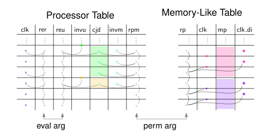

# TIP 0003: Subset Argument for Memory Consistency

| TIP            | 0003                                              |
|:---------------|:--------------------------------------------------|
| authors:       | Alan Szepieniec and Ferdinand Sauer               |
| title:         | Subset Argument for Memory Consistency            |
| status:        | integrated                                          |
| created:       | 2022-08-25                                        |
| issue tracker: | <https://github.com/TritonVM/triton-vm/issues/78> |
| pdf:           | [tip-0003.pdf](tip-0003.pdf)                      |

**Abstract.** In the current specification, the memory-like tables `RamTable`, `JumpStackTable`, and `OpStackTable` do not satisfy memory-consistency. Specifically, they are vulnerable to [Yuncong's attack](https://github.com/TritonVM/triton-vm/issues/12), which exploits the unverified and thus possibly-incorrect sorting in these tables. TIP-0002 addresses one part of the issue by introducing a new table argument, the *multi-table subset argument*. It establishes that certain values in different tables have a matching representative in a given lookup table. Applied to the present context, this technique establishes that every clock jump is positive.

Unfortunately TIP-0002 introduces a lot of design complexity. The cause of this complexity is the Polynomial IOP for correct calculation of the formal derivative.

This TIP proposes an alternative way to establish the requisite set relation, namely through a more traditional AIR/RAP construction that avoids computing the formal derivative entirely.
While there is a performance penalty, the end-result is a noticeably simpler design.

TIPs 0002 and 0003 are mutually exclusive companions to TIP-0001, which introduces an new argument to establish the contiguity of regions of constant memory pointer. Together, TIP-0001 and (TIP-0002 or TIP-0003) fix the memory consistency issue.

## Introduction

How to establish that a clock jump is directed forward (as opposed to directed backward, which would indicate malicious behavior)?
One strategy is to show that the *difference*, *i.e.*, the next clock cycle minus the current clock cycle, is itself a clock cycle.
Recall that the Processor Table's clock cycles run from 0 to $T-1$.
Therefore, a forward directed clock jump's difference is in $F = \{ 1, \dots, T - 1 \} \subseteq \mathbb{F}_p$, whereas a backward directed clock jump's difference is in $B = \{-f \mid f \in F\} = \{ 1 - T, \dots, -1 \} \subseteq \mathbb{F}_p$.
No other clock jump difference can occur.
If $T \ll p/2$, there is no overlap between sets $F$ and $B$.
As a result, in this regime, showing that a clock jump difference is in $F$ guarantees that the jump is forward-directed.

The set of values in the Processor Table's clock cycle column is $F \cup \{0\}$.
Standard subset arguments can show that the clock jump differences are elements of that column.
However, it is cumbersome to repeat this argument for three separate tables.

We present here an AIR/RAP argument for showing that all clock jump differences in all three memory-like tables live also in the Processor Table's `clk` column. It introduces

 - one base column in each memory-like table;
 - one extension column in each memory-like table;
 - four extra base columns in the Processor Table; and
 - three extension columns in the Processor Table.

## Intuition

 - In order to treat clock jump differences of magnitude 1 separately, each memory-like table needs an extra base column $\mathsf{clk\_di}$, which holds the inverse of two consecutive rows' cycle count minus 1, *i.e.*, $\mathsf{clk}' - \mathsf{clk} - 1$, if that inverse exists, and 0 otherwise.
 - A multi-table permutation argument establishes that all clock jump differences (*cjd*s) greater than 1 are contained in a new column $\mathsf{cjd}$ of the Processor Table.
 Every memory-like table needs one extension column and the Processor Table needs one matching extension column to effect this permutation argument.
 - In addition to the extension column computing the running product, the Processor Table needs an inverse column $\mathsf{invm}$ to help select all *nonzero* $\mathsf{cjd}$'s, and thus skip padding rows. The abbreviation *invm* is short for inverse-with-multiplicities.
 - An inverse column $\mathsf{invu}$ in the Processor Table allows for selecting the first row of every contiguous region of $\mathsf{cjd}$.
 The abbreviation *invu* is short for unique-inverse.
 - An evaluation argument establishes that a selection of clock cycles and the unique clock jump differences are identical lists.
 This evaluation argument requires two more extension columns on the Processor Table:
 $\mathsf{rer}$ computes the running evaluation for the *relevant* clock cycles, whereas $\mathsf{reu}$ computes the running evaluation for the *unique* clock jump differences.
 - New register (and base column) “RAM pointer” `ramp` in the Processor Table is the explicit memory pointer for Triton VM's RAM.
 The value held in register `ramp` is updated on executing either of the instructions `read_mem` and `write_mem`, at which time `ramp` is set to the value currently held in stack register `st1`.
 Existing permutation arguments between the Processor Table and the RAM Table are modified to take `ramp`, not `st1`, as the RAM pointer.

The total is 7 extra base columns and 6 extension columns.

## Detailed Description

### Memory-like Tables

Here are the constraints for the RAM Table. The constraints for the other two tables are analogous and are therefore omitted from this section. Elsewhere, the superscripts $^{(r)}$, $^{(j)}$ and $^{(o)}$ disambiguate between the RAM Table, JumpStack Table, and OpStack Table, respectively. The constraints are relative to the indeterminate $X$ which anticipates the verifier's challenge $\alpha$ via the implicit substitution $X \mapsto \alpha$.

Use $\mathsf{mp}$ to abstractly refer to the memory pointer. The first extension column, $\mathsf{rp}$, computes a running product. It starts with 1, giving rise to the boundary constraint $\mathsf{rp} - 1$.

The transition constraint enforces the accumulation of a factor $(X - \mathsf{clk}' + \mathsf{clk})$ whenever the memory pointer is the same or the clock jump difference is greater than 1.
If the memory pointer is changed or the clock jump difference is exactly 1, the same running product is carried to the next row.
Expressed in boolean logic:
$$\begin{aligned}
    \mathsf{clk}' - \mathsf{clk} \neq 1 \wedge \mathsf{mp}' = \mathsf{mp} &\Rightarrow \mathsf{rp}' = \mathsf{rp}(X - (\mathsf{clk}' - \mathsf{clk})) \\
    \mathsf{clk}' - \mathsf{clk} = 1 \vee \mathsf{mp}' \neq \mathsf{mp} &\Rightarrow \mathsf{rp}' = \mathsf{rp}
\end{aligned}$$
The corresponding transition constraint is
$$\begin{aligned}
      &(\mathsf{clk}' - \mathsf{clk} - 1) \cdot (1 - (\mathsf{mp}' - \mathsf{mp})\cdot \mathsf{di}) \cdot (\mathsf{rp}' - \mathsf{rp}(X - (\mathsf{clk}' - \mathsf{clk}))) \\
{}+{} &(1 - (\mathsf{clk}' - \mathsf{clk} - 1)\cdot \mathsf{clk\_di}) \cdot (\mathsf{rp}' - \mathsf{rp}) \\
{}+{} &(\mathsf{mp}' - \mathsf{mp}) \cdot (\mathsf{rp}' - \mathsf{rp}) \enspace .
\end{aligned}$$

Note that $\mathsf{di}$ is the difference inverse of the RAM Table but for the other two tables this factor can be dropped since the corresponding memory pointer can only change by either 0 or 1 between consecutive rows.

The column $\mathsf{clk\_di}$ contains the inverse-or-zero of the two consecutive clocks, minus one.
This consistency requirement induces two transition constraints:

 - $(\mathsf{clk}' - \mathsf{clk} - 1)^2 \cdot \mathsf{clk\_di} - (\mathsf{clk}' - \mathsf{clk} - 1)$, and
 - $(\mathsf{clk}' - \mathsf{clk} - 1) \cdot \mathsf{clk\_di}^2 - \mathsf{clk\_di}$.

### Clock Jump Differences with Multiplicities in the Processor Table

All relevant, *i.e.*, greater-than-1 clock jump differences of the memory-like tables are listed in the $\mathsf{cjd}$ column of the Processor Table.
The values are sorted and the padding inserts “0” rows at the bottom. This relation comes with another extension column computing a running product. Denote this column by $\mathsf{rpm}$.
This running product accumulates a factor $(X - \mathsf{cjd})$ in every row where $\mathsf{cjd} \neq 0$.
Column $\mathsf{invm}$ (for *inverse-with-multiplicities*), which is the inverse-or-zero of $\mathsf{cjd}$, allows writing inequality $\mathsf{cjd} \neq 0$ as a polynomial of low degree.

The first factor is accumulated in the first row, giving rise to boundary constraint
$$\mathsf{cjd}\cdot(\mathsf{rpm} - (X - \mathsf{cjd})) + (1 - \mathsf{invm}\cdot\mathsf{cjd})\cdot(\mathsf{rpm} - 1) \enspace .$$
The transition constraint is
$$ \mathsf{cjd} \cdot (\mathsf{rpm}' - \mathsf{rpm} \cdot (X - \mathsf{cjd})) +  (1 - \mathsf{invm} \cdot \mathsf{cjd}) \cdot (\mathsf{rpm}' - \mathsf{rpm}) \enspace . $$
The consistency constraints for the inverse are

 - $\mathsf{cjd}^2 \cdot \mathsf{invm} - \mathsf{cjd}$, and
 - $\mathsf{cjd} \cdot \mathsf{invm}^2 - \mathsf{invm}$.

The terminal value of this column must be equal to the terminal values of the matching running products of the memory-like tables. The terminal boundary constraint is therefore:
$$ \mathsf{rpm} - \mathsf{rp}^{(r)} \cdot \mathsf{rp}^{(j)} \cdot \mathsf{rp}^{(o)} $$

#### Total Number of Clock Jump Differences with Multiplicities

Recall that the Processor Table has length $T$.
An honest prover can convince the verifier only if the total number of clock jump differences accumulated by the running product $\mathsf{rp}$ is no greater than $T$, independent of the executed program.

If, in the Processor Table, some memory pointer does not change between two consecutive clock cycles, the clock jump difference this produces in the corresponding memory-like table is 1.
Clock jump differences of exactly 1 are treated explicitly and do not require a lookup, *i.e.*, do not contribute a factor to $\mathsf{rp}$.
Thus, $\mathsf{rp}$ accumulates at most $T$ factors if all instructions change at most one of the three memory pointers.
The table [“Modified Memory Pointers by Instruction” in the appendix](#modified-memory-pointers-by-instruction) lists all instructions and the memory pointers they change.

### Unique Clock Jump Differences in the Processor Table

Assume there is an indicator $\mathsf{ind}$ which is 1 whenever the current row of the Processor Table corresponds to a $\mathsf{cjd}$ that is the first in a contiguous clock-jump-difference region.
Using this indicator, build a running evaluation that accumulates one step of evaluation relative to $\mathsf{cjd}$ for each contiguous region, excluding the padding region. The clock jump differences accumulated in this manner are unique, giving rise to the column's name: $\mathsf{reu}$, short for *running evaluation* over *unique* cjd's.

The first clock jump difference is accumulated in the first row, giving rise to the boundary constraint
$$\mathsf{reu} - \beta - \mathsf{cjd} \enspace .$$
The running evaluation accumulates one step of evaluation whenever the indicator bit is set and the new clock jump difference is not padding.
Otherwise, the running evaluation does not change.
Expressed in boolean logic:
$$\begin{aligned}
    \mathsf{ind} = 1 \wedge \mathsf{cjd}' \neq 0 &\Rightarrow \mathsf{reu}' = \beta\cdot\mathsf{reu} + \mathsf{cjd}' \\
    \mathsf{ind} = 0 \vee \mathsf{cjd}' = 0 &\Rightarrow \mathsf{reu}' = \mathsf{reu}
\end{aligned}$$
The following transition constraint captures this transition.
$$\begin{aligned}
      &\mathsf{ind} \cdot \mathsf{cjd}' \cdot (\mathsf{reu}' - \beta\cdot\mathsf{reu} - \mathsf{cjd}') \\
{}+{} &(1 - \mathsf{ind}) \cdot (\mathsf{reu}' - \mathsf{reu}) \\
{}+{} &(1 - \mathsf{cjd}' \cdot \mathsf{invm}') \cdot (\mathsf{reu}' - \mathsf{reu}) \\
\end{aligned}$$
To verify that the indicator is correctly indicating the first row of every contiguous region, we need another column, $\mathsf{invu}$ which contains the inverse-or-zero of every consecutive pair of $\mathsf{cjd}$ values. This induces two transition constraints:

 - $\mathsf{invu}^2 \cdot (\mathsf{cjd} - \mathsf{cjd}') - \mathsf{invu}$
 - $\mathsf{invu} \cdot (\mathsf{cjd} - \mathsf{cjd}')^2 - (\mathsf{cjd} - \mathsf{cjd}')$

Then we can use the $\mathsf{invu}$ column to simulate the indicator bit via $\mathsf{ind} = \mathsf{invu} \cdot (\mathsf{cjd} - \mathsf{cjd}')$.

### Relevant Clock Cycles in the Processor Table

Assume the prover knows when the clock cycle $\mathsf{clk}$ is also *some* jump in a memory-like table and when it's not. Then it can apply the right running evaluation step as necessary. The prover computes this running evaluation in a column called $\mathsf{rer}$, short for *running evaluation* over *relevant* clock cycles.

Since 0 is never a valid clock jump difference, the initial value is 1, giving rise to the initial boundary constraint: $\mathsf{rer} - 1$.

In every row, either the running evaluation step is applied, or else the running evaluation remains the same.
$$ (\mathsf{rer}' - \mathsf{rer}) \cdot (\mathsf{rer}' - \beta \cdot \mathsf{rer} - \mathsf{clk}) $$
The terminal value must be identical to the running evaluation of "Relevant Clock Jumps". This gives rise to the terminal boundary constraint:  $\mathsf{rer} - \mathsf{reu}$.

The indicator does not need to be constrained since if the prover fails to include certain rows he will have a harder (not easier) time convincing the verifier.

## Memory-Consistency

This section shows that TIPs 0001, 0003 jointly imply memory-consistency.

Whenever the Processor Table reads a value "from" a memory-like table, this value appears nondeterministically and is unconstrained by the base table AIR constraints. However, there is a permutation argument that links the Processor Table to the memory-like table in question. *The construction satisfies memory-consistency if it guarantees that whenever a memory cell is read, its value is consistent with the last time that cell was written.*

The above is too informal to provide a meaningful proof for. Let's put formal meanings on the proposition and premises, before reducing the former to the latter.

Let $P$ denote the Processor Table and $M$ denote the memory-like table. Both have height $T$. Both have columns `clk`, `mp`, and `val`. For $P$ the column `clk` coincides with the index of the row. $P$ has another column `ci`, which contains the current instruction, which is `write`, `read`, or `any`. Obviously, `mp` and `val` are abstract names that depend on the particular memory-like table, just like `write`, `read`, and `any` are abstract instructions that depend on the type of memory being accessed. In the following math notation we use $\mathtt{col}$ to denote the column name and $\mathit{col}$ to denote the value that the column might take in a given row.

**Definition 1 (contiguity):** The memory-like table is *contiguous* iff all sublists of rows with the same memory pointer `mp` are contiguous. Specifically, for any given memory pointer $\mathit{mp}$, there are no rows with a different memory pointer $\mathit{mp}'$ in between rows with memory pointer $\mathit{mp}$.

$$ \forall i < j < k \in \lbrace 0, \ldots, T-1 \rbrace : \mathit{mp} \stackrel{\triangle}{=} M[i][\mathtt{mp}] = M[k][\mathtt{mp}] \Rightarrow M[j][\mathtt{mp}] = \mathit{mp} $$

**Definition 2 (regional sorting):** The memory-like table is *regionally sorted* iff for every contiguous region of constant memory pointer, the clock cycle increases monotonically.

$$ \forall i < j \in \lbrace 0, \ldots, T-1 \rbrace : M[i][\mathtt{mp}] = M[j][\mathtt{mp}] \Rightarrow M[i][\mathtt{clk}] <_{\mathbb{Z}} M[j][\mathtt{clk}] $$

The symbol $<_{\mathbb{Z}}$ denotes the integer less than operator, after lifting the operands from the finite field to the integers.

**Definition 3 (memory-consistency):** A Processor Table $P$ has *memory-consistency* if whenever a memory cell at location $\mathit{mp}$ is read, its value corresponds to the previous time the memory cell at location $\mathit{mp}$ was written. Specifically, there are no writes in between the write and the read, that give the cell a different value.

$$ \forall k \in \lbrace 0 , \ldots, T-1 \rbrace : P[k][\mathtt{ci}] = \mathit{read} \, \Rightarrow \left( (1) \, \Rightarrow \, (2) \right)$$

$$ (1) \exists i  \in \lbrace 0 , \ldots, k \rbrace : P[i][\mathtt{ci}] = \mathit{write} \, \wedge \, P[i+1][\mathtt{val}] = P[k][\mathtt{val}] \, \wedge \, P[i][\mathtt{mp}] = P[k][\mathtt{mp}]$$

$$ (2) \nexists j \in \lbrace i+1 , \ldots, k-1 \rbrace : P[j][\mathtt{ci}] = \mathit{write} \, \wedge \, P[i][\mathtt{mp}] = P[k][\mathtt{mp}] $$

**Theorem 1 (memory-consistency):** Let $P$ be a Processor Table. If there exists a memory-like table $M$ such that

 - selecting for the columns `clk`, `mp`, `val`, the two tables' lists of rows are permutations of each other; and
 - $M$ is contiguous and regionally sorted;

then $P$ has memory-consistency.

*Proof.* For every memory pointer value $\mathit{mp}$, select the sublist of rows $P_{\mathit{mp}} \stackrel{\triangle}{=} \lbrace P[k] \, | \, P[k][\mathtt{mp}] = \mathit{mp} \rbrace$ in order. The way this sublist is constructed guarantees that it coincides with the contiguous region of $M$ where the memory pointer is also $\mathit{mp}$.

Iteratively apply the following procedure to $P_{\mathit{mp}}$: remove the bottom-most row if it does not correspond to a row $k$ that constitutes a counter-example to memory consistency. Specifically, let $i$ be the clock cycle of the previous row in $P_{\mathit{mp}}$.

 - If $i$ satisfies $(1)$ then by construction it also satisfies $(2)$. As a result, row $k$ is not part of a counter-example to memory-consistency. We can therefore remove the bottom-most row and proceed to the next iteration of the outermost loop.
 - If $P[i][\mathtt{ci}] \neq \mathit{write}$ then we can safely ignore this row: if there is no clock jump, then the Processor Table's AIR constraints guarantee that $\mathit{val}$ cannot change; and if there is a clock jump, then the memory-like table's AIR constraints guarantee that $\mathit{val}$ cannot change. So set $i$ to the clock cycle of the row above it in $P_{\mathit{mp}}$ and proceed to the next iteration of the inner loop. If there are no rows left for $i$ to index, then there is no possible counterexample for $k$ and so remove the bottom-most row of $P_{\mathit{mp}}$ and proceed to the next iteration of the outermost loop.
 - The case $P[i+1][\mathtt{val}] \neq P[k][\mathtt{val}]$ cannot occur because by construction of $i$, $\mathit{val}$ cannot change.
 - The case $P[i][\mathtt{mp}] \neq P[k][\mathtt{mp}]$ cannot occur because the list was constructed by selecting only elements with the same memory pointer.
 - This list of possibilities is exhaustive.

When $P_{\mathit{mp}}$ consists of only two rows, it can contain no counter-examples. By applying the above procedure, we can reduce every correctly constructed sublist $P_{\mathit{mp}}$ to a list consisting of two rows. Therefore, for every $\mathit{mp}$, the sublist $P_{\mathit{mp}}$ is free of counter-examples to memory-consistency. Equivalently, $P$ is memory-consistent. $\square$

## Appendix

### Modified Memory Pointers by Instruction

|                  |    `osp`     |    `ramp`    |    `jsp`     |
|-----------------:|:------------:|:------------:|:------------:|
|            `pop` | $\mathsf{x}$ |              |              |
|     `push` + `a` | $\mathsf{x}$ |              |              |
|         `divine` | $\mathsf{x}$ |              |              |
|      `dup` + `i` | $\mathsf{x}$ |              |              |
|     `swap` + `i` |              |              |              |
|            `nop` |              |              |              |
|           `skiz` | $\mathsf{x}$ |              |              |
|     `call` + `d` |              |              | $\mathsf{x}$ |
|         `return` |              |              | $\mathsf{x}$ |
|        `recurse` |              |              |              |
|         `assert` | $\mathsf{x}$ |              |              |
|           `halt` |              |              |              |
|       `read_mem` |              | $\mathsf{x}$ |              |
|      `write_mem` |              | $\mathsf{x}$ |              |
|           `hash` |              |              |              |
| `divine_sibling` |              |              |              |
|  `assert_vector` |              |              |              |
|            `add` | $\mathsf{x}$ |              |              |
|            `mul` | $\mathsf{x}$ |              |              |
|         `invert` |              |              |              |
|          `split` | $\mathsf{x}$ |              |              |
|             `eq` | $\mathsf{x}$ |              |              |
|            `lsb` | $\mathsf{x}$ |              |              |
|          `xxadd` |              |              |              |
|          `xxmul` |              |              |              |
|        `xinvert` |              |              |              |
|          `xbmul` | $\mathsf{x}$ |              |              |
|        `read_io` | $\mathsf{x}$ |              |              |
|       `write_io` | $\mathsf{x}$ |              |              |

