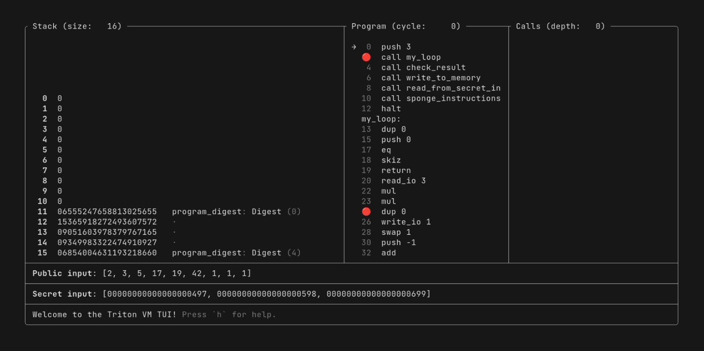

# Where to Go Next

Congrats!
You have completed the tutorial.

You might have noticed that I did not introduce every single one of Triton VM's instructions.
With the knowledge you've gained over the last few lessons, you should be able to understand the behavior of
[any instruction](https://triton-vm.org/spec/instructions.html).

If you would like to give some feedback, feel free to
[open an issue](https://github.com/TritonVM/triton-vm/issues/new?template=BLANK_ISSUE).
I'd appreciate your thoughts!

## Tools

If you want to debug a program or just take a look at how it behaves at runtime, check out
[Triton TUI](https://crates.io/crates/triton-tui).
It's essentially a step-debugger for Triton VM, right in your terminal.

If you want to profile your program, generate proofs for it, or verify such a proof, then take a look at
[Triton CLI](https://crates.io/crates/triton-cli).

If you want to start developing bigger programs, check out [`tasm-lib`](https://crates.io/crates/tasm-lib), a Rust
library that provides re-usable Triton assembly snippets.

## References

When writing Triton assembly, the most important reference is the already-mentioned
[comprehensive list of instructions](https://triton-vm.org/spec/instructions.html).

If you want to take a deeper dive into Triton VM's inner workings, take a look at
[the specification](https://triton-vm.org/spec/isa.html).
You are now already familiar with many of the concepts, but in the specification, they are explained in greater detail
and with a different focus.

## Program Ideas

In case you just want to keep programming in Triton assembly, here are some additional program ideas:

- The Fibonacci sequence.
  For example, you can write the first `n` elements in the Fibonacci sequence to public output.
  Or you can write a program that only halts if the secret input is the `n`th element in the Fibonacci sequence.
- A triangle verifier.
  Read three numbers from public input and verify they can be side lengths of a triangle.
  As a second step, make one side secret and verify that the hidden value from secret input still produces a valid
  triangle.
- A Sudoku verifier.
  As a first step, simply verify that a Sudoku from public input follows the rules.
  In a second step, have only some of the cell entries be public knowledge, and verify that the missing entries
  as filled from secret input are a valid solution.
